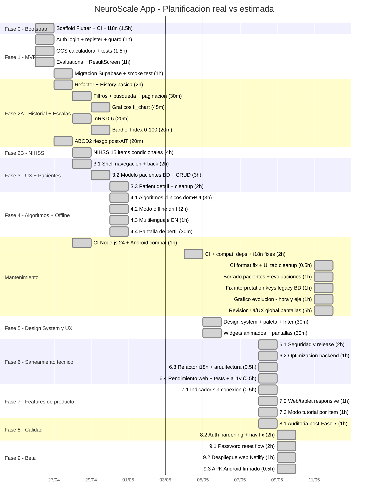

# NeuroScale App

Aplicación multiplataforma **(Android · iOS · Web)** para profesionales de la salud y estudiantes de medicina. Permite aplicar escalas neurológicas estandarizadas, calcular puntuaciones, interpretar resultados clínicos y registrar evaluaciones de forma anonimizada por paciente.

**Producción web:** [neuroscale.netlify.app](https://neuroscale.netlify.app)

---

## Funcionalidades

### Escalas neurológicas
| Escala | Rango | Uso clínico |
|---|---|---|
| GCS (Glasgow Coma Scale) | 3–15 | Nivel de consciencia |
| NIHSS | 0–42 | Gravedad del ictus isquémico |
| mRS (Modified Rankin Scale) | 0–6 | Discapacidad neurológica post-ictus |
| Barthel Index | 0–100 | Independencia funcional en AVD |
| ABCD2 | 0–7 | Riesgo de ictus tras AIT |

### Algoritmos clínicos
Árboles de decisión paso a paso con indicación de urgencia: Código Ictus, HTA en el ictus, HSA (Hunt-Hess / Fisher).

### Pacientes y evaluaciones
- Gestión de pacientes anonimizados (alias libre, sin PII)
- Evaluaciones vinculadas a paciente con notas clínicas
- Gráficos de evolución temporal por escala
- Borrado de pacientes y evaluaciones individuales

### Cuenta y preferencias
- Registro, login, recuperación y cambio de contraseña
- Borrado de cuenta con eliminación completa de datos
- Tema claro / oscuro / sistema (persistido)
- Idioma ES / EN (persistido)

### Calidad técnica
- **191 tests** — calculadoras cubren todos los umbrales clínicos
- Modo offline con SQLite (Drift) para Android e iOS
- Modo tutorial por ítem en escalas complejas
- Responsive: NavigationBar (móvil) / NavigationRail (tablet/web)

---

## Planificación real — Diagrama de Gantt

> Fechas contrastables con los commits de este repositorio.



> Tiempos derivados de los timestamps de los commits de git.
> Total acumulado: **~68h** de trabajo activo (Fases 0–9 + Mantenimiento).

---

## Stack

| Capa | Tecnología |
|---|---|
| Frontend | Flutter 3.41.9 · Material 3 · Inter (google_fonts) |
| Estado | Riverpod (`AsyncNotifier` / `Notifier`) |
| Navegación | go_router · `StatefulShellRoute` |
| Backend | Supabase (Auth + PostgreSQL + RLS + Edge Functions) |
| Offline | Drift (SQLite) — Android e iOS |
| i18n | intl + ARB files — ES + EN |
| Error tracking | Sentry (condicional) |
| CI/CD | GitHub Actions + Netlify |

## Arquitectura

**Feature-first con Clean Architecture.** Flujo estricto:

```
UI → Provider (Riverpod) → UseCase → Repository → DataSource → Supabase
```

- Calculadoras de escalas: **funciones puras** en `domain/` — sin imports Flutter/Supabase, con tests exhaustivos de frontera
- Repositorios lanzan `Failure` (nunca excepciones crudas); datasources lanzan `AppException`
- Navegación persistente: `StatefulShellRoute.indexedStack` con 4 branches
- Offline-first: caché local Drift + sincronización con Supabase al recuperar conexión

## Comandos

```powershell
# Dependencias
flutter pub get

# Tests (191 en total)
flutter test

# Análisis estático
flutter analyze

# Ejecutar en web (dev)
flutter run --dart-define-from-file=env/dev.json -d chrome

# Formatear
dart format lib test
```

> Requiere `env/dev.json` (usa `env/dev.example.json` como plantilla). La app arranca sin credenciales — Supabase y Sentry se inicializan condicionalmente.

## Documentación

- [`docs/ROADMAP.md`](docs/ROADMAP.md) — fases, entregables y decisiones de diseño
- [`docs/METODOLOGIA_Y_PLANIFICACION.md`](docs/METODOLOGIA_Y_PLANIFICACION.md) — metodología, planificación estimada vs real, análisis de desviaciones (~68h)
- [Issues y milestones](https://github.com/grisllo/NeuroScaleApp/issues) — trazabilidad completa de tareas
