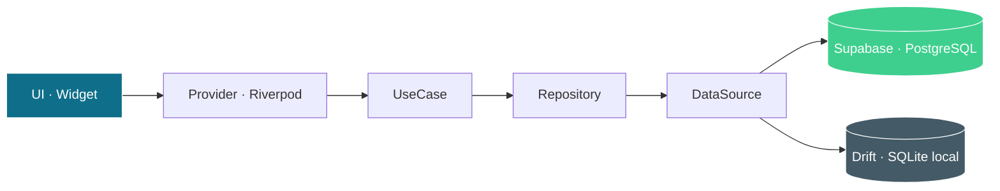

# NeuroScale App

[](https://github.com/grisllo/NeuroScaleApp/actions/workflows/ci.yaml)
[](https://github.com/grisllo/NeuroScaleApp/actions/workflows/deploy.yml)
[](LICENSE)
[](https://github.com/grisllo/NeuroScaleApp/releases/tag/v1.0.0)

Aplicación multiplataforma **(Android · iOS · Web)** para profesionales de la salud y estudiantes de medicina. Permite aplicar escalas neurológicas estandarizadas, calcular puntuaciones, interpretar resultados clínicos y registrar evaluaciones de forma anonimizada por paciente.

**Producción web**: [grisllo.github.io/NeuroScaleApp](https://grisllo.github.io/NeuroScaleApp/)

---

## Estado del proyecto

| Indicador | Valor |
|---|---|
| Versión publicada | `v1.0.0` (2026-05-13) |
| Tests automatizados | **204** (`flutter analyze`: 0 issues) |
| Cobertura de dominio | 100 % en todos los umbrales clínicos |
| Hosting web | GitHub Pages (deploy automático) |
| Backend | Supabase (`eu-west-2`) — 11 migraciones aplicadas |
| Idiomas de la interfaz | Español, inglés (519 entradas ARB por idioma) |
| Plataformas soportadas | Android (API 21+), iOS, web |
| Horas de desarrollo | ~91 h de sesión activa |

---

## Funcionalidades

### Escalas neurológicas

| Escala | Rango | Uso clínico |
|---|---|---|
| GCS (Glasgow Coma Scale) | 3–15 | Nivel de consciencia |
| NIHSS | 0–42 | Gravedad del ictus isquémico |
| mRS (Modified Rankin Scale) | 0–6 | Discapacidad neurológica post-ictus |
| Barthel Index | 0–100 | Independencia funcional en actividades de la vida diaria |
| ABCD2 | 0–7 | Riesgo de ictus tras accidente isquémico transitorio |

### Algoritmos clínicos

Árboles de decisión paso a paso con indicación de urgencia clasificada (`critical`, `high`, `moderate`, `low`):

- **Código Ictus** — indicación de fibrinolisis intravenosa (tPA) en ventana 3–4,5 h.
- **HTA en ictus agudo** — manejo de la presión arterial según tipo de ictus (isquémico con o sin reperfusión, hemorragia intracerebral, hemorragia subaracnoidea).
- **HSA Hunt-Hess / Fisher** — clasificación clínica y radiológica de la hemorragia subaracnoidea.

### Pacientes y evaluaciones

- Gestión de pacientes anonimizados (alias libre, sin información identificativa).
- Evaluaciones vinculadas a paciente con descripción del caso clínico.
- Gráficos de evolución temporal por escala (`fl_chart`).
- Borrado granular de pacientes y evaluaciones individuales.

### Cuenta y preferencias

- Registro, inicio de sesión, recuperación y cambio de contraseña.
- Borrado de cuenta con eliminación completa de datos asociados (Edge Function).
- Tema claro, oscuro o automático (sigue al sistema).
- Idioma español o inglés (persistido en `SharedPreferences`).

### Calidad técnica

- **204 tests automatizados** — calculadoras cubren todos los umbrales clínicos, más widget tests de pantallas críticas.
- Modo offline con SQLite (Drift) en Android e iOS — caché local con sincronización al recuperar conexión.
- Modo tutorial por ítem en escalas complejas (GCS, NIHSS, Barthel, ABCD2).
- Diseño responsive: `NavigationBar` (móvil), `NavigationRail` (tablet), `NavigationRail` extendido (desktop).

---

## Stack tecnológico

| Capa | Tecnología | Versión |
|---|---|---|
| Lenguaje | Dart | SDK ^3.8.0 |
| Framework | Flutter (stable channel) | 3.41.9 |
| Sistema de diseño | Material 3 · Inter (`google_fonts`) | 6.2.1 |
| Gestión de estado | `flutter_riverpod` | 3.1.0 |
| Navegación | `go_router` · `StatefulShellRoute` | 17.2.3 |
| Backend | Supabase (Auth + PostgreSQL + RLS + Edge Functions) | SDK 2.12.4 |
| Persistencia local | Drift (SQLite) | 2.31.0 |
| Internacionalización | `intl` · archivos ARB (ES + EN) | 0.20.2 |
| Gráficas | `fl_chart` | 1.2.0 |
| Conectividad | `connectivity_plus` | 6.1.1 |
| Error tracking | Sentry (inicialización condicional) | 9.19.0 |
| Testing | `flutter_test` · `mocktail` | 1.0.5 |
| CI/CD | GitHub Actions · GitHub Pages | — |

---

## Arquitectura

El proyecto sigue **feature-first con Clean Architecture** en cada feature. El flujo de datos es unidireccional y estricto:



Reglas clave:

- Calculadoras de escalas: **funciones puras** en `domain/`, sin imports de Flutter ni Supabase, con tests exhaustivos de frontera.
- Repositorios lanzan `Failure` (nunca excepciones crudas); los datasources lanzan `AppException`; los controladores capturan con `AsyncValue.guard()`.
- Navegación persistente: `StatefulShellRoute.indexedStack` con cuatro ramas (escalas, pacientes, algoritmos, perfil).
- Estrategia offline-first: caché local Drift + sincronización con Supabase al recuperar conexión.

La estructura física del proyecto se documenta en [`docs/ROADMAP.md`](docs/ROADMAP.md) y [`CLAUDE.md`](CLAUDE.md).

---

## Comandos

Todos los comandos asumen PowerShell en Windows. En macOS/Linux funcionan con sintaxis equivalente.

```powershell
# Dependencias
flutter pub get

# Tests (204 en total)
flutter test

# Análisis estático
flutter analyze

# Ejecutar en web (entorno de desarrollo)
flutter run --dart-define-from-file=env/dev.json -d chrome

# Formatear código
dart format lib test

# Build web para producción (GitHub Pages)
flutter build web --dart-define-from-file=env/prod.json --base-href /NeuroScaleApp/
```

> Requiere `env/dev.json` (usa `env/dev.example.json` como plantilla). La aplicación arranca sin credenciales: Supabase y Sentry se inicializan condicionalmente, mostrando placeholders cuando faltan las claves.

---

## Capturas de pantalla

> Pendiente de incorporar capturas finales. Espacios reservados para la futura inclusión.

| Pantalla | Móvil | Web/tablet |
|---|---|---|
| Login | `[CAPTURA: login móvil]` | `[CAPTURA: login web]` |
| Disclaimer médico | `[CAPTURA: disclaimer móvil]` | `[CAPTURA: disclaimer web]` |
| Tab de escalas | `[CAPTURA: lista escalas móvil]` | `[CAPTURA: grid escalas web]` |
| Calculadora GCS | `[CAPTURA: GCS móvil]` | `[CAPTURA: GCS web]` |
| Resultado de evaluación | `[CAPTURA: resultado móvil]` | `[CAPTURA: resultado web]` |
| Detalle de paciente con evolución | `[CAPTURA: paciente móvil]` | `[CAPTURA: paciente web]` |
| Algoritmo Código Ictus | `[CAPTURA: algoritmo móvil]` | `[CAPTURA: algoritmo web]` |
| Perfil y preferencias | `[CAPTURA: perfil móvil]` | `[CAPTURA: perfil web]` |

---

## Planificación real — diagrama de Gantt

> Fechas verificadas contra los timestamps de los commits del repositorio.

```mermaid
gantt
    title NeuroScale App - Planificacion real vs estimada
    dateFormat  YYYY-MM-DD
    axisFormat  %d/%m

    section Fase 0 - Bootstrap
    Scaffold Flutter + CI + i18n (1.5h)      :done, f0,   2026-04-26, 1d

    section Fase 1 - MVP
    Auth login + register + guard (1h)       :done, f1a,  2026-04-26, 1d
    GCS calculadora + tests (1.5h)           :done, f1b,  2026-04-26, 1d
    Evaluations + ResultScreen (1h)          :done, f1c,  2026-04-26, 1d
    Migracion Supabase + smoke test (1h)     :done, f1d,  2026-04-27, 1d

    section Fase 2A - Historial + Escalas
    Refactor + History basica (2h)           :done, f2a1, 2026-04-27, 1d
    Filtros + busqueda + paginacion (30m)    :done, f2a2, after f2a1, 1d
    Graficos fl_chart (45m)                  :done, f2a3, after f2a2, 1d
    mRS 0-6 (20m)                            :done, f2a4, after f2a3, 1d
    Barthel Index 0-100 (20m)                :done, f2a5, after f2a4, 1d
    ABCD2 riesgo post-AIT (20m)              :done, f2a6, after f2a5, 1d

    section Fase 2B - NIHSS
    NIHSS 15 items condicionales (4h)        :done, f2b,  2026-04-28, 1d

    section Fase 3 - UX + Pacientes
    3.1 Shell navegacion + back (2h)         :done, f3a,  2026-04-28, 1d
    3.2 Modelo pacientes BD + CRUD (3h)      :done, f3b,  2026-04-29, 1d
    3.3 Patient detail + cleanup (2h)        :done, f3c,  2026-04-30, 1d

    section Fase 4 - Algoritmos + Offline
    4.1 Algoritmos clinicos dom+UI (3h)      :done, f4a,  2026-04-30, 1d
    4.2 Modo offline drift (2h)              :done, f4b,  2026-04-30, 1d
    4.3 Multilenguaje EN (1h)                :done, f4c,  2026-04-30, 1d
    4.4 Pantalla de perfil (30m)             :done, f4d,  2026-04-30, 1d

    section Mantenimiento
    CI Node.js 24 + Android compat (1h)      :done, mnt0, 2026-04-28, 1d
    CI + compat. deps + i18n fixes (2h)      :done, mnt,  2026-05-04, 1d
    CI format fix + UI tab cleanup (0.5h)    :done, mnt2, 2026-05-11, 1d
    Borrado pacientes + evaluaciones (1h)    :done, mnt3, 2026-05-11, 1d
    Fix interpretation keys legacy BD (1h)   :done, mnt4, 2026-05-11, 1d
    Grafico evolucion - hora y eje (1h)      :done, mnt5, 2026-05-11, 1d
    Revision UI/UX global pantallas (5h)     :done, mnt6, 2026-05-11, 1d

    section Fase 5 - Design System y UX
    Design system + paleta + Inter (30m)     :done, f5a,  2026-05-05, 1d
    Widgets animados + pantallas (30m)       :done, f5b,  2026-05-05, 1d

    section Fase 6 - Saneamiento tecnico
    6.1 Seguridad y release (2h)             :done, f6a,  2026-05-08, 1d
    6.2 Optimizacion backend (1h)            :done, f6b,  2026-05-08, 1d
    6.3 Refactor i18n + arquitectura (0.5h)  :done, f6c,  2026-05-08, 1d
    6.4 Rendimiento web + tests + a11y (0.5h) :done, f6d,  2026-05-08, 1d

    section Fase 7 - Features de producto
    7.1 Indicador sin conexion (0.5h)        :done, f7a,  2026-05-08, 1d
    7.2 Web/tablet responsive (1h)           :done, f7b,  2026-05-08, 1d
    7.3 Modo tutorial por item (1h)          :done, f7c,  2026-05-08, 1d

    section Fase 8 - Calidad
    8.1 Auditoria post-Fase 7 (1h)           :done, f8a,  2026-05-08, 1d
    8.2 Auth hardening + nav fix (2h)        :done, f8b,  2026-05-09, 1d

    section Fase 9 - Beta
    9.1 Password reset flow (2h)             :done, f9a,  2026-05-09, 1d
    9.2 Despliegue web Netlify (1h)          :done, f9b,  2026-05-09, 1d
    9.3 APK Android firmado (0.5h)           :done, f9c,  2026-05-09, 1d

    section Fase 10 - Polish
    10.P0 Errores localizados + LICENSE (1.5h) :done, f10a, 2026-05-12, 1d
    10.P1 ValidationException + scale_metadata (1h) :done, f10b, 2026-05-12, 1d
    10.P2 RadioGroup migration + docs (0.5h) :done, f10c, 2026-05-12, 1d

    section Fase 11 - UX Visual
    11.1 Hash avatar cross-platform + layout web (2h) :done, f11a, 2026-05-12, 1d
    11.2 Auth card navy + tema claro calido (1h) :done, f11b, 2026-05-12, 1d
    11.3 Icono y logo oficial (1.5h)            :done, f11c, 2026-05-12, 1d

    section Fase 12 - Animaciones
    12.1 Transiciones pagina + FadeSlideItem (1.5h) :done, f12a, 2026-05-12, 1d
    12.2 AnimatedCheck + circulo resultado (1h) :done, f12b, 2026-05-12, 1d
    12.3 Algoritmos Q-Q + Q-Result reveal (1h) :done, f12c, 2026-05-12, 1d
    12.4 Fixes movil — icono + nombre + centrado (0.5h) :done, f12d, 2026-05-12, 1d
    12.5 Algoritmos — jerarquia pregunta + thumb-friendly (0.5h) :done, f12e, 2026-05-12, 1d

    section Fase 13 - Fixes UX evaluaciones
    13.1 Paciente obligatorio al guardar + fix case_description (1h) :done, f13a, 2026-05-13, 1d
    13.2 Disclaimer SnackBar por escala — primera vez (0.5h) :done, f13b, 2026-05-13, 1d
    13.3 Fix FilledButton apagado — backgroundColor+foregroundColor explícitos (0.1h) :done, f13c, 2026-05-13, 1d
    13.4 UX pacientes — tab Evaluaciones + cabecera Evolución web (0.1h) :done, f13d, 2026-05-13, 1d
    13.5 Toast disclaimer superior-derecha web + SnackBar swipe móvil (0.5h) :done, f13e, 2026-05-13, 1d
    13.6 NavigationRail jerarquía visual — fondo diferenciado claro/oscuro (0.1h) :done, f13f, 2026-05-13, 1d
    13.7 Ordenación evaluaciones por paciente — reciente, antigua, por escala (0.2h) :done, f13g, 2026-05-13, 1d
    13.8 PatientAvatar iniciales inteligentes — P001→P1, P002→P2 (0.2h) :done, f13h, 2026-05-13, 1d
    13.9 Spinner carga web + homepage GitHub Pages (0.2h) :done, f13i, 2026-05-13, 1d
    13.10 Fix producción web — BOM y sufijo /rest/v1 en SUPABASE_URL (2.5h) :done, f13j, 2026-05-13, 1d

    section Fase 14 - Auditoria y produccion v1.0.0
    14.Audit Auditoria multi-dim + plan (1.5h)                    :done, f14au, 2026-05-13, 1d
    14.A Criticos produccion — RLS+Sentry PII+validacion (0.75h)  :done, f14a,  2026-05-13, 1d
    14.B Tokens spacing/radii — 90 SizedBox + 15 BorderRadius (0.75h) :done, f14b, 2026-05-13, 1d
    14.C Accesibilidad — Semantics + tooltips + ARB (0.25h)       :done, f14c,  2026-05-13, 1d
    14.D Tests widget — PatientAvatar + ProfileScreen (0.25h)     :done, f14d,  2026-05-13, 1d
    14.E Documentacion — RELEASE+SECURITY+CONTRIBUTING (0.25h)   :done, f14e,  2026-05-13, 1d
    14.F Cobertura + ROADMAP + tag v1.0.0 (0.25h)                :done, f14f,  2026-05-13, 1d

    section Post v1.0.0 - Mantenimiento
    ROADMAP restructura + auditoria documentacion (0.5h)          :done, pv1a, 2026-05-14, 1d
    Licencia propietaria + badge CI + favicon (0.25h)             :done, pv1b, 2026-05-14, 1d
    Auth screens: fondo tema + titulo teal (0.5h)                 :done, pv1c, 2026-05-14, 1d
    Fix jerarquia inputs dark mode — fillColor outline (0.25h)    :done, pv1d, 2026-05-14, 1d
    Pulido integral 9 docs — README+ROADMAP+METODOLOGIA+SECURITY (3h) :done, pv1e, 2026-05-14, 1d
    Pulido docs — RELEASE+CONTRIBUTING+supabase+android+CLAUDE (1h)  :done, pv1f, 2026-05-14, 1d
```

> **Fechas**: verificadas contra los timestamps de los commits de Git (contrastables en el historial).
>
> **Horas**: tiempo de sesión del desarrollador dirigiendo activamente la implementación (revisión de salidas, testing manual, decisiones de diseño y redirección del agente). En el desarrollo asistido por IA el tiempo de implementación ocurre entre commits, no después.
>
> **Granularidad**: el ordenado dentro del mismo día es por sección y orden de aparición — Mermaid no soporta orden intradiario con granularidad por hora.
>
> **Total acumulado**: ~91 h de sesión activa (Fases 0–14 + Mantenimiento + Post v1.0.0).

---

## Licencia

Este proyecto se distribuye bajo una **licencia propietaria** (`All Rights Reserved`). El código fuente, los recursos visuales y la documentación son confidenciales y no pueden ser reproducidos, distribuidos, modificados ni utilizados sin autorización expresa por escrito del titular.

Para consultas de licenciamiento, evaluación comercial o uso académico, contactar con:

**Arturo Ramos Reparaz** — `arturo.ramos.reparaz@gmail.com`

Véase el archivo [`LICENSE`](LICENSE) para los términos completos.

---

## Documentación

| Documento | Contenido |
|---|---|
| [`docs/ROADMAP.md`](docs/ROADMAP.md) | Fases, entregables y decisiones de diseño desde Fase 0 hasta post v1.0.0. |
| [`docs/METODOLOGIA_Y_PLANIFICACION.md`](docs/METODOLOGIA_Y_PLANIFICACION.md) | Metodología de trabajo, planificación estimada vs real, análisis de desviaciones (~87 h totales). |
| [`docs/RELEASE_GUIDE.md`](docs/RELEASE_GUIDE.md) | Build de APK / web / iOS, gestión de secretos, despliegue, checklist pre-release. |
| [`docs/SECURITY.md`](docs/SECURITY.md) | Modelo de seguridad: RLS, gestión de PII, secretos, Sentry, reporte de vulnerabilidades. |
| [`docs/CONTRIBUTING.md`](docs/CONTRIBUTING.md) | Flujo de PR, Conventional Commits, convenciones de código, accesibilidad. |
| [`supabase/README.md`](supabase/README.md) | Migraciones SQL, convenciones, modelo ER, Edge Functions. |
| [`android/README.md`](android/README.md) | Configuración del keystore y firma de release. |
| [`CLAUDE.md`](CLAUDE.md) | Instrucciones para el agente Claude Code (stack, comandos, convenciones). |

**Trazabilidad pública**: [Issues y milestones en GitHub](https://github.com/grisllo/NeuroScaleApp/issues) — los issues `#1`–`#23` cubren las fases 0 a 9; las fases 10–14 quedan reflejadas en el Gantt y en `docs/ROADMAP.md`.
