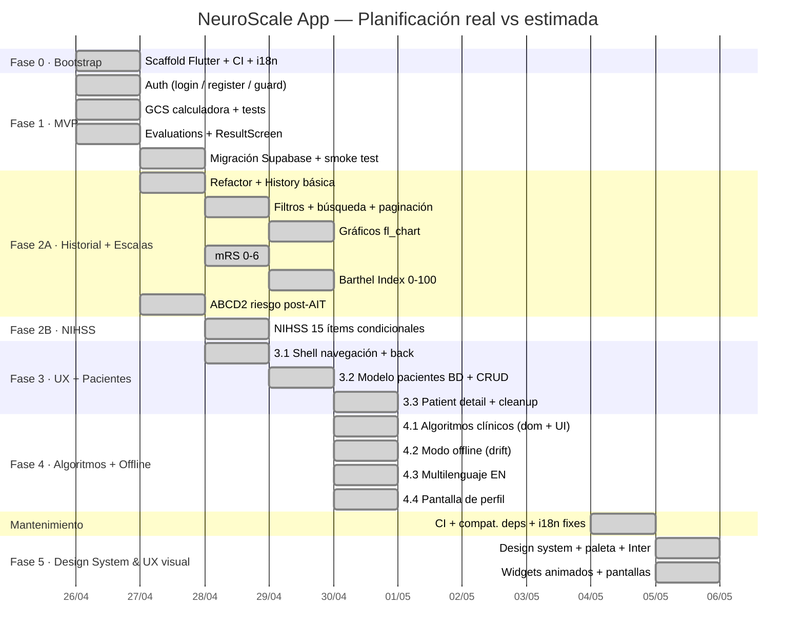

# NeuroScale App

Aplicación multiplataforma (Android · iOS · Web) para aplicar, calcular e interpretar escalas neurológicas clínicas: GCS, NIHSS, mRS, Barthel e ABCD2.

Dirigida a profesionales de la salud y estudiantes. Backend: Supabase (Auth + PostgreSQL + RLS).

---

## Planificación real — Diagrama de Gantt

> Fechas contrastables con los commits de este repositorio.



---

## Stack

| Capa | Tecnología |
|---|---|
| Frontend | Flutter 3.x · Material 3 · Inter (google_fonts) |
| Estado | Riverpod (`AsyncNotifier`) |
| Navegación | go_router |
| Backend | Supabase (Auth + PostgreSQL + RLS) |
| i18n | intl + ARB files |
| CI | GitHub Actions |

## Arquitectura

Feature-first con Clean Architecture. Flujo estricto:
`UI → Provider → UseCase → Repository → DataSource → Supabase`

Las calculadoras de escalas son **funciones puras** en `domain/` — sin imports Flutter/Supabase, testables de forma exhaustiva.

## Comandos

```powershell
# Instalar dependencias
flutter pub get

# Tests
flutter test

# Análisis estático
flutter analyze

# Ejecutar en Chrome (dev)
flutter run --dart-define-from-file=env/dev.json -d chrome
```

## Documentación

- [`docs/ROADMAP.md`](docs/ROADMAP.md) — fases, entregables y decisiones de diseño
- [`docs/METODOLOGIA_Y_PLANIFICACION.md`](docs/METODOLOGIA_Y_PLANIFICACION.md) — metodología, planificación estimada vs real, análisis de desviaciones
- [Issues y milestones](https://github.com/grisllo/NeuroScaleApp/issues) — trazabilidad completa de tareas
