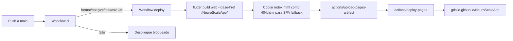

# Guía de release — NeuroScale App

Procedimiento completo para construir, firmar, publicar y, en su caso, revertir un release de NeuroScale App en sus tres plataformas (Android, iOS, web).

---

## Tabla de contenidos

- [1. Prerrequisitos](#1-prerrequisitos)
- [2. Variables de entorno](#2-variables-de-entorno)
- [3. Versionado semántico](#3-versionado-semántico)
- [4. Builds](#4-builds)
  - [4.1 Web (GitHub Pages)](#41-web-github-pages)
  - [4.2 APK Android](#42-apk-android)
  - [4.3 iOS (Archive)](#43-ios-archive)
- [5. CI/CD](#5-cicd)
  - [5.1 Pipelines](#51-pipelines)
  - [5.2 Secretos en GitHub Actions](#52-secretos-en-github-actions)
  - [5.3 Flujo de despliegue web](#53-flujo-de-despliegue-web)
- [6. Procedimiento de release](#6-procedimiento-de-release)
- [7. Procedimiento de rollback](#7-procedimiento-de-rollback)
- [8. Checklist pre-release](#8-checklist-pre-release)

---

## 1. Prerrequisitos

- **Flutter 3.41.9** en canal `stable` (verifica con `flutter --version`).
- **`env/prod.json`** configurado (a partir de la plantilla `env/dev.example.json`).
- **Android**: keystore firmado disponible (ver [`android/README.md`](../android/README.md)).
- **iOS**: certificado de distribución instalado en Keychain Access (macOS) y perfil de provisioning vigente.

---

## 2. Variables de entorno

Crea `env/prod.json` (gitignored) con la siguiente estructura:

```json
{
  "SUPABASE_URL": "https://<project-ref>.supabase.co",
  "SUPABASE_ANON_KEY": "<anon-key>",
  "SUPABASE_REDIRECT_URL": "https://grisllo.github.io/NeuroScaleApp/",
  "SENTRY_DSN": "<sentry-dsn>",
  "FLAVOR": "prod"
}
```

> **Importante**: `SUPABASE_URL` debe ser la URL base del proyecto Supabase, **sin** el sufijo `/rest/v1`. La clase `Env` sanitiza el valor para resistir errores de copiado, pero conviene guardar el formato correcto.

---

## 3. Versionado semántico

El proyecto sigue [Semantic Versioning 2.0.0](https://semver.org/lang/es/). El número de versión vive en `pubspec.yaml` en el formato `MAJOR.MINOR.PATCH+BUILD`.

| Cambio | Bump | Ejemplo |
|---|---|---|
| Rotura de compatibilidad con la base de datos, contratos de RLS o API pública | MAJOR | `1.0.0` → `2.0.0` |
| Nueva funcionalidad sin romper compatibilidad | MINOR | `1.0.0` → `1.1.0` |
| Corrección de errores y mejoras menores | PATCH | `1.0.0` → `1.0.1` |
| Cualquier rebuild para Play Store / App Store | BUILD | `1.0.0+1` → `1.0.0+2` |

El componente `+BUILD` es obligatorio en Android (versionCode) y se incrementa en cada release subido a las tiendas.

Cada release publicado se etiqueta en Git:

```powershell
git tag -a v1.0.0 -m "Release v1.0.0 — auditoría y producción"
git push origin v1.0.0
```

> Nota: en el estado actual, `pubspec.yaml` mantiene `1.0.0-beta+1` por compatibilidad de cachés. El tag `v1.0.0` está publicado en GitHub. El bump completo se aplicará en el primer release post-1.0.

---

## 4. Builds

Todos los comandos asumen PowerShell en Windows. En macOS / Linux funcionan con sintaxis equivalente, salvo el build iOS que requiere macOS.

### 4.1 Web (GitHub Pages)

```powershell
flutter build web --dart-define-from-file=env/prod.json --base-href /NeuroScaleApp/
```

- El artefacto queda en `build/web/`.
- El argumento `--base-href` es obligatorio en GitHub Pages para que las rutas relativas resuelvan correctamente.
- El despliegue ocurre automáticamente al hacer push a `main` mediante el workflow `.github/workflows/deploy.yml`.

### 4.2 APK Android

```powershell
flutter build apk --release --dart-define-from-file=env/prod.json
```

- El artefacto queda en `build/app/outputs/flutter-apk/app-release.apk` (≈ 66 MB).
- Se firma automáticamente si existe `android/key.properties` correctamente configurado.
- Para verificar la firma del binario, consulta [`android/README.md`](../android/README.md).

### 4.3 iOS (Archive)

```bash
# macOS exclusivamente
flutter build ipa --dart-define-from-file=env/prod.json
```

Luego, en macOS:

1. Abrir el archive generado en `build/ios/archive/Runner.xcarchive`.
2. Xcode → Window → Organizer → Archives → Distribute App.
3. Seleccionar método de distribución (App Store Connect, Ad Hoc, Enterprise).

---

## 5. CI/CD

### 5.1 Pipelines

| Workflow | Disparador | Pasos |
|---|---|---|
| [`ci.yaml`](../.github/workflows/ci.yaml) | Push o PR a `main` | `dart format --set-exit-if-changed` · `flutter analyze` · `flutter test --coverage` · `osv-scanner` sobre `pubspec.lock`. |
| [`deploy.yml`](../.github/workflows/deploy.yml) | Push a `main` (tras `ci` verde) | Build web con `--base-href` + `--dart-define-from-file` · publicación en GitHub Pages mediante `actions/deploy-pages@v4`. |

Un fallo en CI bloquea el despliegue automático. El job `vulnerability-scan` corre como `needs: analyze-and-test`, por lo que solo se ejecuta si los tests pasan.

### 5.2 Secretos en GitHub Actions

Los secretos requeridos por `deploy.yml` se configuran en **Settings → Secrets and variables → Actions → New repository secret**.

| Nombre | Uso |
|---|---|
| `SUPABASE_URL` | Inyectado en el build web mediante `--dart-define`. |
| `SUPABASE_ANON_KEY` | Inyectado en el build web mediante `--dart-define`. |
| `SUPABASE_REDIRECT_URL` | URL de retorno tras flujos de OAuth y recuperación de contraseña. Debe coincidir con la URL configurada en Supabase Authentication → URL Configuration. |
| `SENTRY_DSN` _(solo builds locales)_ | No lo inyecta `deploy.yml` actualmente; úsalo en `env/prod.json` para builds manuales. Si se omite, Sentry no se inicializa y la aplicación funciona con normalidad. |

> El workflow `ci.yaml` no requiere ningún secreto — `flutter analyze` y `flutter test` se ejecutan con un valor `dart-define` vacío. Las llamadas reales a Supabase no se prueban en CI.

### 5.3 Flujo de despliegue web



---

## 6. Procedimiento de release

1. **Trabajo previo en rama**: feature/fix completado, tests verdes, `flutter analyze` en 0 issues.
2. **Merge a `main`**: el push dispara CI; al pasar, el deploy publica automáticamente en GitHub Pages.
3. **Bump de versión** (cuando proceda): editar `pubspec.yaml`, commit `chore(release): bump to vX.Y.Z+N`.
4. **Tagging**:
   ```powershell
   git tag -a vX.Y.Z -m "Release vX.Y.Z — <resumen>"
   git push origin vX.Y.Z
   ```
5. **Builds adicionales** (APK / iOS) si aplica, siguiendo §4.
6. **Notas de release** en GitHub: redactar a partir de los commits incluidos en el rango `vPrev..vNew` (`git log vPrev..HEAD --oneline`).
7. **Documentación**: actualizar [`docs/ROADMAP.md`](ROADMAP.md) si el release cierra una fase y [`docs/METODOLOGIA_Y_PLANIFICACION.md`](METODOLOGIA_Y_PLANIFICACION.md) si afecta a la planificación.

---

## 7. Procedimiento de rollback

Si un despliegue introduce una regresión crítica:

### 7.1 Web (GitHub Pages)

**Opción A — revertir vía `git revert` (preferida)**:

```powershell
git revert <hash-commit-malo>
git push origin main
```

El push dispara automáticamente un nuevo deploy con el estado anterior.

**Opción B — redeploy de un commit anterior**:

1. **Actions → Deploy to GitHub Pages → Run workflow → seleccionar branch/commit**.
2. Verificar la URL de producción tras unos minutos.

> No utilizar `git reset --hard` ni `git push --force` sobre `main`: rompería el historial compartido y dejaría el repositorio en un estado inconsistente para otros desarrolladores.

### 7.2 APK Android

- Si el APK aún no se ha distribuido: descartarlo localmente.
- Si se distribuyó vía sideload: notificar a los usuarios y proporcionar el APK anterior.
- Si se publicó en Play Store: utilizar **Play Console → App releases → Production → Manage releases → Rollback** (no instantáneo: tarda varias horas en propagarse).

### 7.3 Base de datos (Supabase)

Las migraciones no son automáticamente reversibles. Si una migración introduce un problema:

1. Identificar el cambio problemático y diseñar la migración inversa.
2. Aplicarla a través de Supabase Studio → SQL Editor (ver [`supabase/README.md`](../supabase/README.md)).
3. Registrarla con el siguiente número correlativo (`NNNN_revert_xxxx.sql`).

---

## 8. Checklist pre-release

Antes de etiquetar un release oficial:

- [ ] `flutter analyze` — 0 issues.
- [ ] `flutter test` — 100 % verde (al menos 204 tests al cierre de v1.0.0).
- [ ] `dart format --set-exit-if-changed lib test` — 0 cambios.
- [ ] Versión actualizada en `pubspec.yaml` (`version: X.Y.Z+N`).
- [ ] Changelog actualizado en [`docs/ROADMAP.md`](ROADMAP.md).
- [ ] Documentación actualizada si afecta a configuración o despliegue.
- [ ] Tag de release creado (`git tag -a vX.Y.Z && git push origin vX.Y.Z`).
- [ ] APK probado en dispositivo físico Android.
- [ ] Web de producción verificada en <https://grisllo.github.io/NeuroScaleApp/>.
- [ ] Supabase Advisors revisados (Performance + Security) sin alertas nuevas.

---

## Documentos relacionados

- [`../android/README.md`](../android/README.md) — configuración del keystore y firma de APK.
- [`SECURITY.md`](SECURITY.md) — gestión de secretos y modelo de seguridad.
- [`../supabase/README.md`](../supabase/README.md) — aplicación de migraciones a base de datos.
- [`ROADMAP.md`](ROADMAP.md) — fases, decisiones y cierres documentados.
