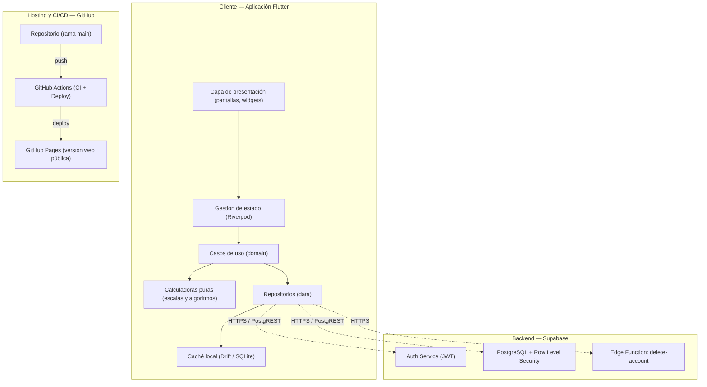
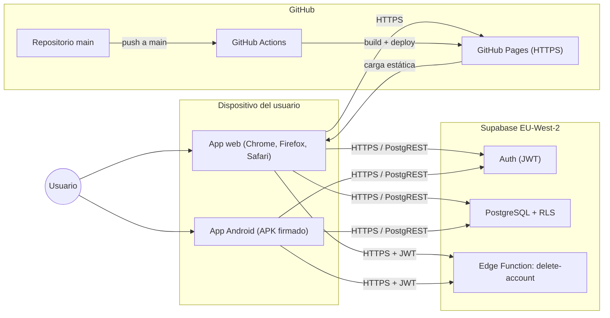
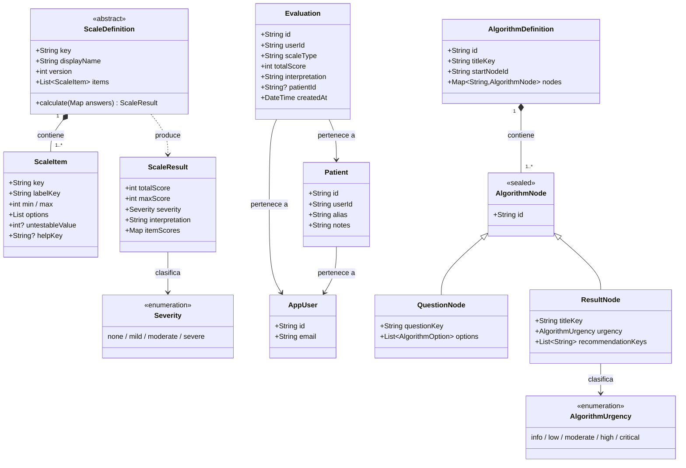
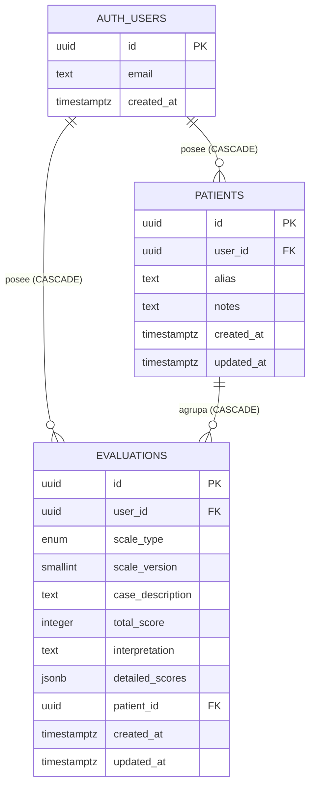
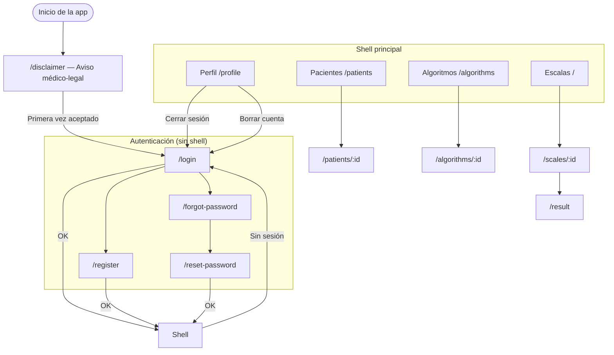

# Diseños

Los diagramas de esta sección se pueden visualizar directamente en GitHub abriendo este fichero, que renderiza Mermaid de forma nativa. Las capturas externas (Supabase, GitHub Actions, interfaces de la app) se insertarán manualmente en el documento final.

---

## Arquitectura de la solución

Muestra cómo el cliente Flutter se organiza en capas (presentación, dominio, datos) y cómo estas se conectan con los servicios externos de Supabase y con el hosting de GitHub.

---

## Diagrama de despliegue y comunicación

Muestra dónde se ejecuta cada componente del sistema y qué protocolos usa para comunicarse.

---

## Diagrama de clases del dominio

Muestra las entidades del dominio (escalas, algoritmos, evaluaciones, pacientes) y sus relaciones. No incluye las capas de datos ni de presentación, que dependen del dominio y no al revés.

---

## Modelo entidad-relación

Muestra las dos tablas de aplicación (`evaluations` y `patients`), su relación con los usuarios de Supabase Auth y las tres claves foráneas con borrado en cascada.

> *Captura complementaria: Supabase Studio → Database → Schema Visualizer ofrece una vista visual generada automáticamente del mismo esquema.*

---

## Esquema físico de la base de datos

| Aspecto | Solución aplicada |
|---|---|
| Identificadores | UUID con generación automática |
| Marcas de tiempo | `timestamptz` actualizadas por trigger en cada UPDATE |
| Borrado en cascada | Tres FK con `ON DELETE CASCADE` |
| Índices | `(user_id, created_at DESC)` en evaluaciones; `(patient_id)` para filtrar por paciente |
| Seguridad | RLS activo en ambas tablas con cuatro políticas por tabla (select, insert, update, delete) |
| Validaciones | `alias` entre 1 y 255 caracteres; `case_description` máximo 500 caracteres |

> *Capturas: Supabase Studio → Table Editor (evaluations y patients), Authentication → Policies, Database → Indexes, Database → Migrations.*

---

## Diagrama de flujo de navegación

Muestra las pantallas de la aplicación y las transiciones entre ellas, incluyendo el comportamiento del guardián de autenticación.

---

## Sistema de diseño visual

### Paleta de colores clínicos

| Token | Color | Uso |
|---|---|---|
| `severity_none` | Verde | Sin déficit / independencia total |
| `severity_mild` | Azul | Déficit leve / riesgo bajo |
| `severity_moderate` | Naranja | Déficit moderado / riesgo moderado |
| `severity_severe` | Rojo | Déficit grave / urgencia crítica |
| `scale_gcs` | Índigo | Identificador visual GCS |
| `scale_nihss` | Teal | Identificador visual NIHSS |
| `scale_rankin` | Violeta | Identificador visual mRS |
| `scale_barthel` | Verde oscuro | Identificador visual Barthel |
| `scale_abcd2` | Naranja oscuro | Identificador visual ABCD² |

### Tipografía y responsive

Tipografía principal: **Inter** (Google Fonts). Diseñada para pantallas, amplia gama de pesos, jeraquía visual sin mezclar familias. Escala tipográfica de Material Design 3.

| Dispositivo | Navegación | Columnas | Ancho máximo |
|---|---|---|---|
| Móvil (< 600 dp) | Barra inferior | 1 | Sin límite |
| Tablet / escritorio (≥ 600 dp) | Panel lateral | 2 | 800 dp |

---

## Capturas de la interfaz

> *Las siguientes capturas corresponden a la versión 1.0.0 en producción.*

### Login (web)

### Cuadrícula de escalas (web / tablet)

### Formulario de escala — GCS (móvil)

### Resultado de escala (móvil)

### Gráfico de evolución de paciente (web)

### Algoritmo clínico (web)

### Tema claro

### Gráfico en tema claro

---

## Capturas de infraestructura

> *Las siguientes capturas se insertan manualmente desde Supabase Studio y GitHub.*

**Supabase Studio:**
- Schema Visualizer (`Database → Schema Visualizer`)
- Editor de tablas (`Table Editor → evaluations` y `patients`)
- Políticas RLS (`Authentication → Policies`)
- Migraciones (`Database → Migrations`)
- Edge Function (`Edge Functions → delete-account`)

**GitHub:**
- Pipeline CI en verde (`Actions → ci`)
- Pipeline deploy en verde (`Actions → deploy`)
- GitHub Pages configurado (`Settings → Pages`)
- Release v1.0.0 (`Releases → v1.0.0`)
