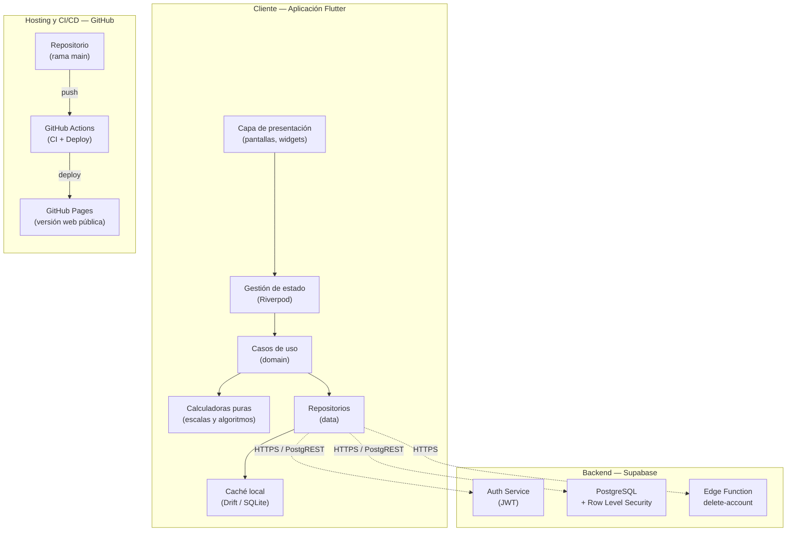
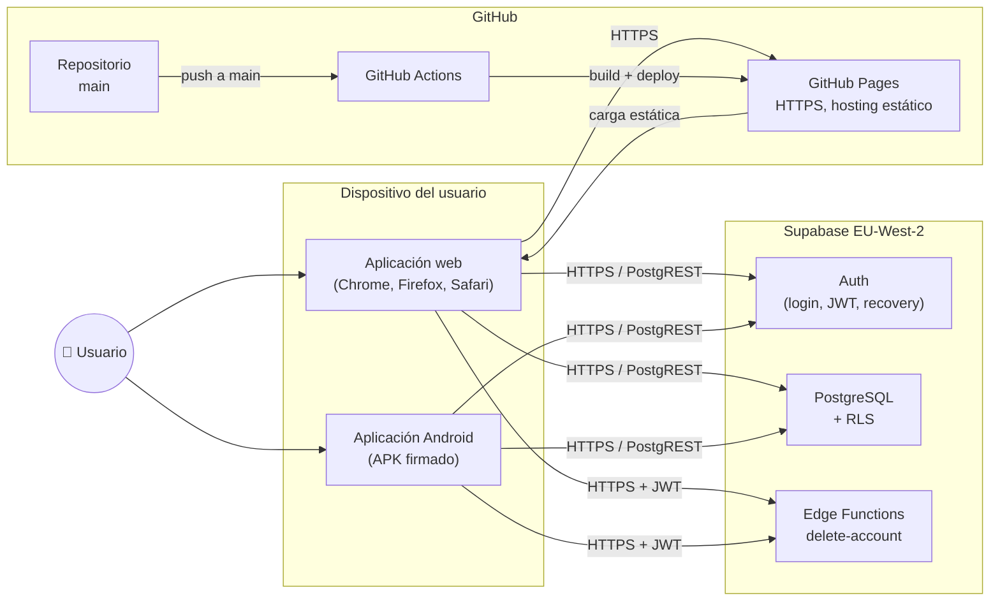
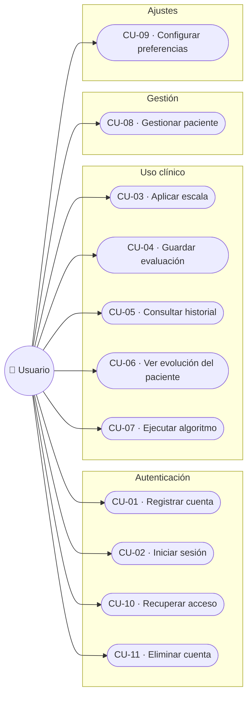
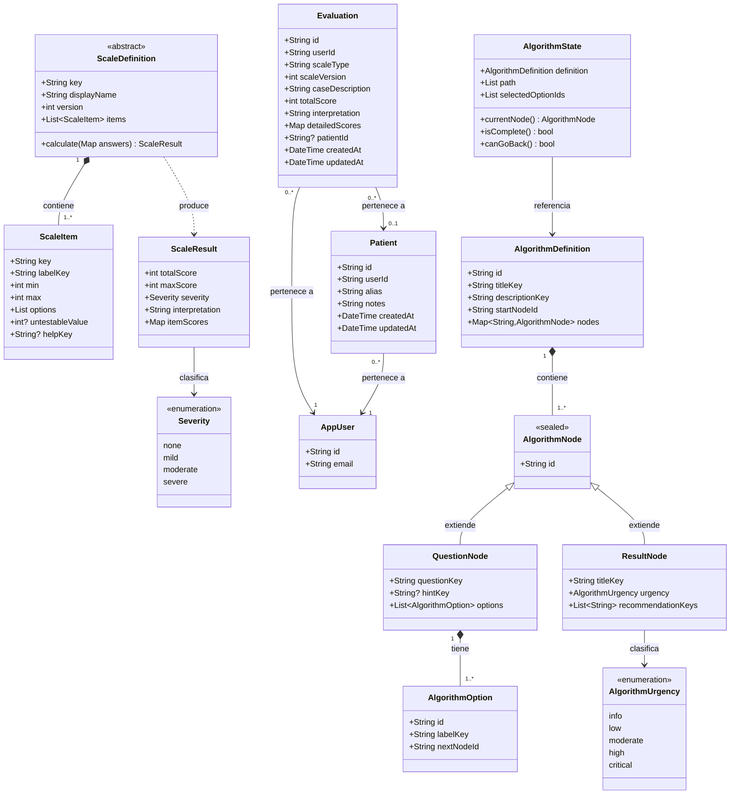
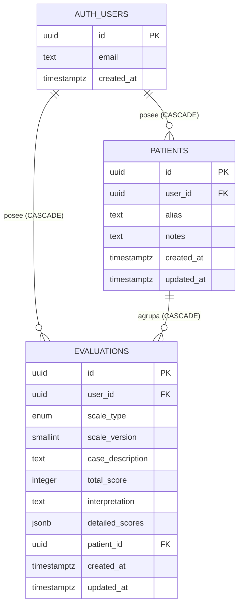

# Diseños

Esta sección reúne los diagramas que documentan el sistema desde distintos planos: la arquitectura de alto nivel, el despliegue, los casos de uso, el modelo de clases del dominio, el modelo de datos, el flujo de navegación y el lenguaje visual de la interfaz. Cada diagrama responde a una pregunta concreta y los textos que los acompañan están pensados para complementarlos, no para repetirlos.

> Los bloques de código etiquetados como `mermaid` se pueden renderizar en [mermaid.live](https://mermaid.live) y exportar como PNG o SVG para insertarlos como imagen en el documento Word final.

---

## Arquitectura de la solución

El sistema completo se divide en tres planos diferenciados: el cliente, que es la aplicación Flutter ejecutándose en el dispositivo del usuario o en su navegador; el backend gestionado por Supabase, que se ocupa de la autenticación, la base de datos y las funciones de servidor; y la infraestructura de hosting y entrega continua, alojada en GitHub.

El diagrama siguiente muestra cómo se organizan los componentes del cliente en capas y cómo se relacionan con los servicios externos.



Lo importante de este diagrama no es la lista de tecnologías —que se discute con detalle en el apartado de Tecnología—, sino la dirección de las dependencias. La presentación nunca habla directamente con el backend; siempre pasa por un caso de uso, que a su vez delega en un repositorio que actúa como única puerta hacia el exterior. Esta jerarquía permite, por ejemplo, sustituir la implementación de un repositorio sin tocar la interfaz, o testear los casos de uso de forma aislada con un repositorio falso.

---

## Diagrama de despliegue y comunicación

Mientras la arquitectura describe **cómo está organizado el código**, el diagrama de despliegue describe **dónde se ejecuta cada cosa y cómo se comunican** los distintos componentes. Es la visión que necesita un equipo de operaciones o de seguridad para entender el flujo real de datos.



Todas las comunicaciones externas viajan por HTTPS. La autenticación se realiza con tokens JWT firmados por Supabase, que el cliente incluye en cada petición posterior a las tablas o a la función de servidor. Cuando el cliente accede a la base de datos no lo hace mediante SQL plano, sino a través de PostgREST, la capa REST automática que Supabase genera sobre el esquema; esto permite que las políticas RLS se apliquen sobre cada petición sin que el cliente tenga que conocer la estructura interna del filtro.

---

## Diagrama de casos de uso

El diagrama UML de casos de uso resume, en una sola imagen, todas las acciones que un usuario puede realizar sobre el sistema. NeuroScale App tiene un único tipo de actor —el usuario autenticado o no, según el caso de uso— y once casos de uso principales, agrupados en cuatro bloques funcionales.



La descripción formal de cada caso de uso —actor, precondiciones, postcondiciones, flujo principal y flujos alternativos— se encuentra en el apartado de Descripción del sistema. La siguiente tabla resume los once casos para consulta rápida:

| Código | Caso de uso | Bloque |
|---|---|---|
| CU-01 | Registrar nueva cuenta | Autenticación |
| CU-02 | Iniciar sesión | Autenticación |
| CU-03 | Aplicar una escala neurológica | Uso clínico |
| CU-04 | Guardar evaluación | Uso clínico |
| CU-05 | Consultar historial | Uso clínico |
| CU-06 | Ver evolución temporal de un paciente | Uso clínico |
| CU-07 | Ejecutar un algoritmo clínico | Uso clínico |
| CU-08 | Gestionar un paciente | Gestión |
| CU-09 | Configurar preferencias | Ajustes |
| CU-10 | Recuperar acceso con contraseña olvidada | Autenticación |
| CU-11 | Eliminar cuenta y datos | Autenticación |

---

## Diagrama de clases del dominio

Este diagrama recoge las entidades del dominio (la capa más interna de la arquitectura) y sus relaciones. Las capas de datos y presentación no aparecen aquí porque su misión es servir y consumir el dominio, no extenderlo: las reglas de dependencia que se describen en el apartado de Arquitectura general garantizan que ese contrato se respeta.



Las dos jerarquías importantes son `ScaleDefinition` (con cinco implementaciones, una por escala) y `AlgorithmNode` (con dos subtipos cerrados, `QuestionNode` y `ResultNode`). Esta segunda jerarquía aprovecha la característica de *sealed classes* de Dart 3, que garantiza en tiempo de compilación que cualquier código que distinga entre tipos de nodo cubre todos los casos posibles; si en el futuro se añadiera un tercer subtipo, el compilador señalaría todos los lugares del proyecto donde habría que actualizar el tratamiento.

---

## Modelo entidad-relación

El modelo entidad-relación muestra las tablas de aplicación y su relación con la tabla `auth.users` que gestiona internamente Supabase. La estructura es deliberadamente sencilla: dos tablas de aplicación, tres claves foráneas y reglas de borrado en cascada para garantizar que no quedan registros huérfanos.



La columna `evaluations.patient_id` es anulable de forma intencional: existen evaluaciones legítimamente no asociadas a ningún paciente —por ejemplo, una prueba puntual—, y por tanto no debe forzarse la relación. Las tres relaciones se borran en cascada, de modo que cuando un usuario se da de baja desaparecen también sus pacientes y todas sus evaluaciones, sin posibilidad de dejar registros huérfanos en la base de datos.

> **Diagrama complementario sugerido:** la vista *Schema Visualizer* del panel de Supabase (Database → Schema Visualizer) ofrece una representación visual idéntica generada automáticamente a partir del esquema real. Puede incluirse como captura de pantalla complementaria al diagrama anterior.

---

## Esquema físico de la base de datos

Más allá del modelo lógico, conviene documentar los detalles físicos del esquema que afectan al rendimiento y a la seguridad:

| Aspecto | Cómo está resuelto |
|---|---|
| **Identificadores** | `uuid` con generación automática mediante `gen_random_uuid()` |
| **Marcas de tiempo** | `timestamptz` (con zona horaria) actualizados por trigger en cada UPDATE |
| **Borrado en cascada** | Tres restricciones FK con `ON DELETE CASCADE` |
| **Índices** | Compuesto `(user_id, created_at DESC)` en `evaluations` para listado rápido del historial. Índice por `patient_id` para filtrar evaluaciones de un paciente |
| **Seguridad** | Row Level Security activado en ambas tablas, con cuatro políticas simétricas (select, insert, update, delete) que filtran por `auth.uid() = user_id` |
| **Validaciones** | `alias` con longitud entre 1 y 255 caracteres; `case_description` con longitud máxima de 500 caracteres |

> **Capturas sugeridas desde Supabase Studio:**
>
> - **Editor de tablas** (`Table Editor → evaluations` y `Table Editor → patients`): muestra las columnas reales con sus tipos.
> - **Políticas RLS** (`Authentication → Policies`): vista de las ocho políticas activas.
> - **Migraciones** (`Database → Migrations`): lista de las once migraciones aplicadas en orden.
> - **Indexes** (`Database → Indexes`): los tres índices de aplicación.

---

## Diagrama de flujo de navegación

El siguiente diagrama refleja las pantallas de la aplicación y las transiciones entre ellas, incluyendo el comportamiento del guardián de autenticación, que se indica con la etiqueta `[auth]` en las flechas que produce.

```mermaid
flowchart TD
    Start([Inicio de la app]) --> Disclaimer

    Disclaimer["/disclaimer<br/>Aviso médico-legal"] -->|Primera vez aceptado| Login

    subgraph autenticacion["Flujo de autenticación (sin shell)"]
        Login["/login<br/>Inicio de sesión"]
        Register["/register<br/>Registro"]
        ForgotPwd["/forgot-password<br/>Recuperación"]
        ResetPwd["/reset-password<br/>Nueva contraseña"]
        Login -->|Enlace| ForgotPwd
        Login -->|Enlace| Register
        ForgotPwd -->|Email enviado + enlace abierto| ResetPwd
    end

    Login -->|Credenciales correctas| Shell
    Register -->|Registro completado| Shell
    ResetPwd -->|Contraseña cambiada| Shell

    subgraph shellsub["Shell principal (StatefulShellRoute)"]
        direction TB
        Tab0["Escalas  /"]
        Tab1["Pacientes  /patients"]
        Tab2["Algoritmos  /algorithms"]
        Tab3["Perfil  /profile"]
    end

    Tab0 --> ScaleForm["/scales/:id<br/>Formulario de escala"]
    ScaleForm --> Result["/result<br/>Puntuación + Guardar"]
    Result -->|Guardar| Tab0

    Tab1 --> PatientDetail["/patients/:id<br/>Detalle + gráfico"]

    Tab2 --> AlgoRun["/algorithms/:id<br/>Ejecución paso a paso"]

    Tab3 -->|Cerrar sesión| Login
    Tab3 -->|Borrar cuenta| Login

    Shell -->|Sin sesión (auth)| Login
```

Las rutas de autenticación viven fuera del *shell* principal, lo que significa que cuando el usuario está en una de ellas no ve la barra de navegación. El shell principal, en cambio, mantiene cuatro ramas con su propio historial cada una, de modo que cambiar de pestaña no descarta el estado de la rama anterior: si estabas a mitad de aplicar una escala, vuelves justo donde la dejaste.

---

## Sistema visual

### Paleta de colores clínicos

La paleta se diseñó para que la severidad de un resultado fuera reconocible de un vistazo sin que el color fuera la única señal disponible (la etiqueta textual siempre acompaña al color, en cumplimiento del criterio WCAG 1.4.1 sobre uso del color).

| Token | Color | Uso clínico |
|---|---|---|
| `severity_none` | Verde | Sin déficit / independencia total |
| `severity_mild` | Azul | Déficit leve / riesgo bajo |
| `severity_moderate` | Naranja | Déficit moderado / riesgo moderado |
| `severity_severe` | Rojo | Déficit grave / urgencia crítica |
| `scale_gcs` | Índigo | Identificador visual de la GCS |
| `scale_nihss` | Teal | Identificador visual del NIHSS |
| `scale_rankin` | Violeta | Identificador visual del mRS |
| `scale_barthel` | Verde oscuro | Identificador visual del Barthel |
| `scale_abcd2` | Naranja oscuro | Identificador visual del ABCD² |

### Tipografía

La fuente principal es **Inter**, una tipografía sans-serif diseñada específicamente para pantallas. Se eligió por su legibilidad en formularios densos y por la amplitud de pesos disponibles, que permite construir jerarquía visual sin recurrir a varias familias distintas. La escala tipográfica sigue las convenciones de Material Design 3.

### Adaptación responsive

| Dispositivo | Navegación | Columnas | Ancho máximo del contenido |
|---|---|---|---|
| Móvil (< 600 dp) | Barra inferior | 1 | Sin límite |
| Tablet y escritorio (≥ 600 dp) | Panel lateral | 2 cuando procede | 800 dp |

---

## Diseño de interfaces

Las siguientes capturas corresponden a la versión 1.0.0 actualmente publicada.

### Pantalla de inicio de sesión (web)


En tablet y escritorio, la tarjeta de login aparece centrada sobre el color primario del tema. En móvil ocupa toda la pantalla. El logotipo combina un cerebro vectorial con una línea de electrocardiograma como elemento de identidad visual.

### Cuadrícula de escalas (web)


La pestaña de escalas presenta las cinco escalas como tarjetas en una cuadrícula de dos columnas en tablet. Cada tarjeta muestra el nombre, el rango y el color identificativo de la escala. El panel lateral izquierdo es la `NavigationRail` que sustituye a la barra inferior cuando la pantalla supera los 600 dp.

### Formulario GCS (móvil)


El formulario de escala presenta los ítems uno a uno con una barra de progreso en la parte superior. La opción seleccionada se resalta con el color de la escala. El botón con el signo de interrogación abre la ficha del modo tutorial.

### Pantalla de resultado (móvil)


La puntuación total aparece en un círculo con el color de severidad correspondiente. Debajo se muestra el desglose por ítem y el aviso clínico. El botón de guardar permanece fijo en la parte inferior; al pulsarlo, una animación de check confirma que la operación se completó.

### Gráfico de evolución de paciente (web)


El detalle del paciente combina el historial de evaluaciones con un gráfico de líneas que muestra la evolución temporal. El eje horizontal es proporcional al tiempo real entre evaluaciones, y los tooltips muestran la puntuación exacta al pulsar cualquier punto.

### Algoritmo clínico (web)


La pantalla del algoritmo presenta cada pregunta con sus opciones como tarjetas táctiles. La animación lateral entre nodos refuerza visualmente la idea de avance por un árbol de decisión. El resultado final muestra el nivel de urgencia con el color clínico correspondiente y las recomendaciones asociadas.

### Tema claro — pantalla de escalas


Vista de la aplicación con el tema claro activado. La paleta usa tonos teal y navy sobre fondo blanco roto, manteniendo el contraste mínimo WCAG AA en todos los textos.

### Gráfico en tema claro


Detalle del gráfico de evolución en tema claro. La cuadrícula de guía usa trazos finos para no competir visualmente con la línea de datos.

---

## Capturas complementarias recomendadas

Para reforzar el apartado de diseños con material real del proyecto, se sugiere incluir las siguientes capturas obtenidas directamente de los paneles de Supabase y GitHub. Todas son automáticas y muestran que el sistema está en funcionamiento.

### Desde Supabase Studio

- **Schema Visualizer** (`Database → Schema Visualizer`): vista visual de las relaciones entre `evaluations`, `patients` y `auth.users`, generada automáticamente desde el esquema real.
- **Table Editor** (`Table Editor → evaluations` y `patients`): muestra las columnas con sus tipos reales y algunas filas de datos demostrativos.
- **Authentication → Policies**: las ocho políticas RLS activas, con su definición SQL visible.
- **Authentication → Users**: lista de usuarios registrados (incluido el usuario de demostración).
- **Edge Functions → delete-account**: vista del código TypeScript de la función y su configuración (`verify_jwt = true`).
- **Database → Migrations**: lista de las once migraciones aplicadas en orden.
- **Database → Indexes**: los tres índices físicos creados para optimizar consultas habituales.
- **Database → Advisors**: muestra que no hay alertas de seguridad ni de rendimiento pendientes.

### Desde GitHub

- **Actions → ci**: workflow de integración continua con todos los pasos en verde (formato, análisis, tests, cobertura, escáner de vulnerabilidades).
- **Actions → deploy**: workflow de despliegue completado con éxito tras un push reciente a `main`.
- **Settings → Pages**: configuración del hosting estático que sirve la aplicación web.
- **Releases → v1.0.0**: página del *release* publicado con sus notas y enlaces a los artefactos.
