# Diseños

> **Nota sobre los diagramas Mermaid**: los bloques de código etiquetados con `mermaid` se pueden renderizar en [mermaid.live](https://mermaid.live), exportar como PNG/SVG e insertar como imágenes en el documento Word final.

---

## Diagrama de clases del dominio

El diagrama recoge las entidades principales de la capa `domain/` de cada feature. Las capas `data/` y `presentation/` no aparecen para mantener la legibilidad; la regla de dependencia garantiza que el dominio nunca importa de las capas superiores.

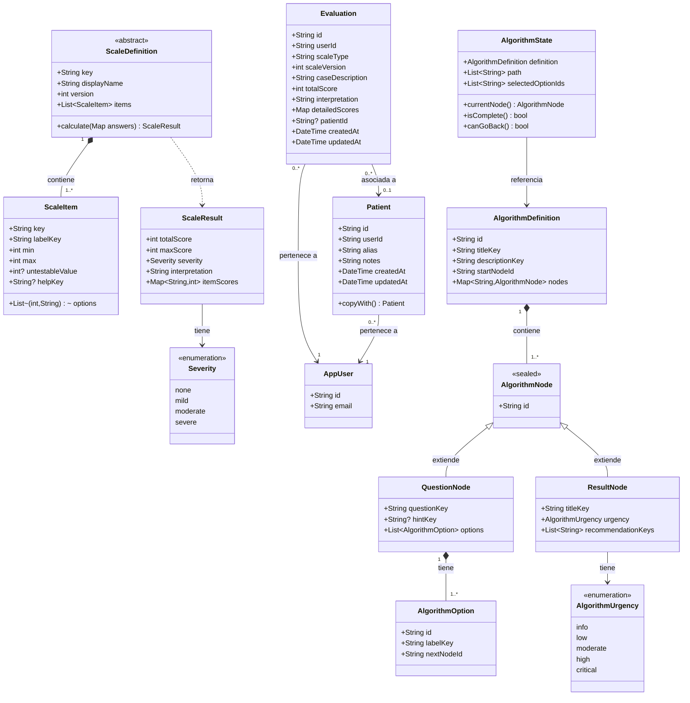

### Jerarquía de herencia de `ScaleDefinition`

Cada escala implementa `ScaleDefinition` con su propia lista de ítems y calculadora:

| Clase concreta | Ítems | Rango | Calculadora |
|---|---|---|---|
| `GcsDefinition` | 3 (Ocular, Verbal, Motor) | 3–15 | `calculateGcs()` |
| `NihssDefinition` | 11 (más soporte `UN`) | 0–42 | `calculateNihss()` |
| `RankinDefinition` | 1 (selección directa) | 0–6 | `calculateRankin()` |
| `BarthelDefinition` | 10 (AVD) | 0–100 | `calculateBarthel()` |
| `Abcd2Definition` | 5 (factores de riesgo) | 0–7 | `calculateAbcd2()` |

### Jerarquía de `AlgorithmNode`

`AlgorithmNode` es una `sealed class`: el compilador garantiza la exhaustividad del `switch` en la UI. Solo existen dos subtipos:

- **`QuestionNode`**: presenta una pregunta con N opciones; cada opción apunta al `nextNodeId` del siguiente nodo.
- **`ResultNode`**: nodo hoja que no tiene opciones; contiene el título del resultado, el nivel de urgencia clínica y la lista de recomendaciones.

---

## Modelo entidad-relación

El diagrama muestra las dos tablas de aplicación y su relación con la tabla `auth.users` de Supabase (gestionada internamente por el servicio de autenticación).

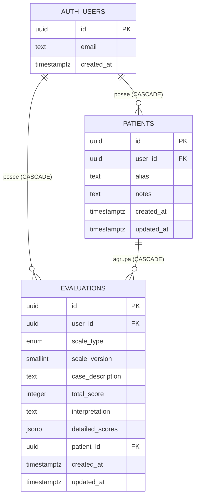

### Políticas de integridad referencial

| FK | Tabla origen | Tabla destino | ON DELETE |
|---|---|---|---|
| `evaluations.user_id` | `evaluations` | `auth.users` | `CASCADE` — al borrar el usuario se borran todas sus evaluaciones |
| `patients.user_id` | `patients` | `auth.users` | `CASCADE` — al borrar el usuario se borran todos sus pacientes |
| `evaluations.patient_id` | `evaluations` | `patients` | `CASCADE` (migración 0007) — al borrar el paciente se borran sus evaluaciones |

La columna `evaluations.patient_id` es nullable: las evaluaciones creadas antes de la introducción del módulo de pacientes (o sin asociar a un caso) mantienen `patient_id = NULL` y no se ven afectadas por el borrado de pacientes.

### Seguridad a nivel de fila (RLS)

Ambas tablas tienen RLS habilitado. Las cuatro políticas de cada tabla restringen el acceso a las filas donde `(select auth.uid()) = user_id`. La subselección evita la evaluación de `auth.uid()` por cada fila escaneada (migración 0009), reduciendo el coste en tablas con muchas filas por usuario.

---

## Diagrama de navegación

El diagrama muestra los estados de pantalla y las transiciones posibles. Las transiciones producidas por el guard de autenticación se indican con `[auth]`.

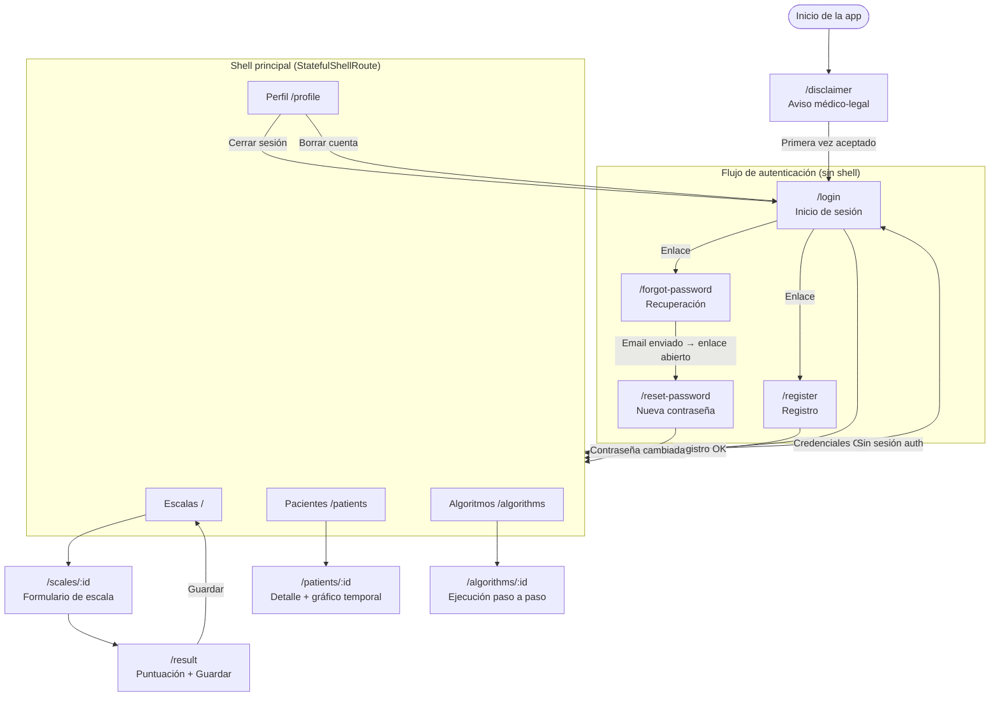

---

## Diseño del sistema visual

### Paleta de colores clínicos

El sistema de diseño define una paleta semántica (`ClinicalColors`) que mapea los niveles de severidad y urgencia a colores coherentes en tema claro y oscuro:

| Token | Color (claro) | Uso |
|---|---|---|
| `severity_none` | Verde `#4CAF50` | Sin déficit, independencia total |
| `severity_mild` | Azul `#2196F3` | Déficit leve, riesgo bajo |
| `severity_moderate` | Naranja `#FF9800` | Déficit moderado, riesgo moderado |
| `severity_severe` | Rojo `#F44336` | Déficit grave, urgencia crítica |
| `scale_gcs` | Índigo | Identificador visual de la escala GCS |
| `scale_nihss` | Teal | Identificador visual de la escala NIHSS |
| `scale_rankin` | Violeta | Identificador visual de mRS |
| `scale_barthel` | Verde oscuro | Identificador visual de Barthel |
| `scale_abcd2` | Naranja oscuro | Identificador visual de ABCD² |

La información de gravedad nunca se transmite únicamente por color: cada resultado incluye además la etiqueta textual de severidad (`leve`, `moderado`, `grave`) para cumplir el criterio de accesibilidad WCAG 1.4.1.

### Tipografía

La fuente principal es **Inter** (Google Fonts), elegida por su legibilidad en pantallas de alta densidad y su amplio soporte de pesos para establecer jerarquía visual entre títulos, cuerpo y etiquetas clínicas. La escala tipográfica sigue el sistema de tokens de Material Design 3 (`displayLarge`, `headlineMedium`, `bodyMedium`, `labelSmall`).

### Diseño responsive

La aplicación usa un único breakpoint de **600 dp** para adaptar la navegación y los layouts:

| Dispositivo | Navegación | Columnas (grids) | Max-width de contenido |
|---|---|---|---|
| Móvil (< 600 dp) | `NavigationBar` inferior | 1 columna | Sin límite |
| Tablet / escritorio (≥ 600 dp) | `NavigationRail` lateral | 2 columnas | 800 dp |

---

## Diseño de interfaces

Las siguientes capturas corresponden a la versión v1.0.0 en producción.

### Pantalla de inicio de sesión (web)

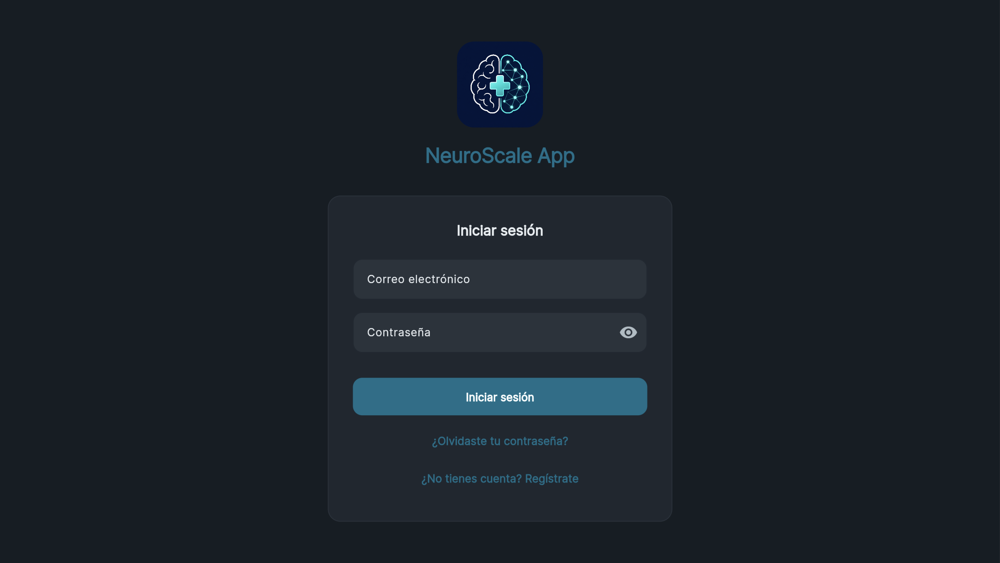

La pantalla de autenticación presenta una tarjeta centrada sobre el fondo de color primario en tablet y escritorio. En móvil, la tarjeta ocupa toda la pantalla. El logotipo `NsLogo` (cerebro vectorial con ECG) actúa como marca visual de la aplicación.

### Cuadrícula de escalas (web)

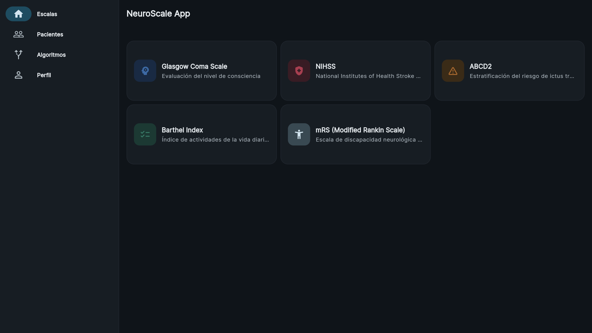

La pestaña de escalas presenta las cinco escalas en un grid de dos columnas en tablet. Cada tarjeta muestra el nombre, el rango y el color único de la escala. La `NavigationRail` es visible en el margen izquierdo con las cuatro secciones principales.

### Formulario GCS (móvil)

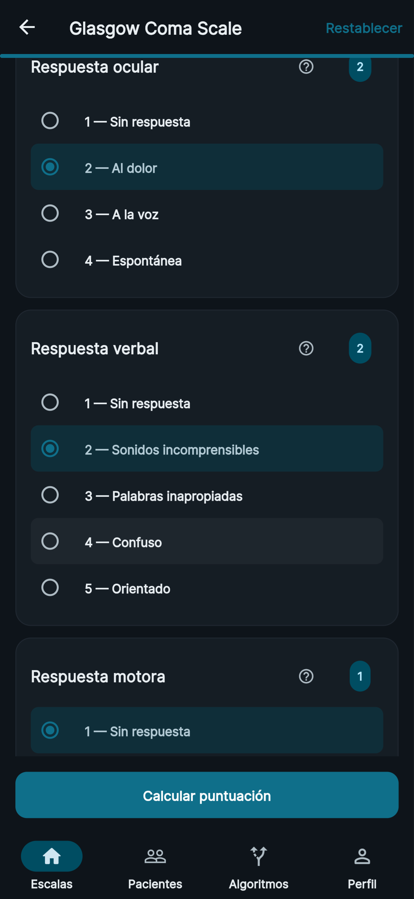

El formulario de escala presenta los ítems secuencialmente con una barra de progreso en la parte superior. La opción seleccionada se resalta con el color de la escala. El botón ? de cada ítem abre el modo tutorial.

### Pantalla de resultado (móvil)

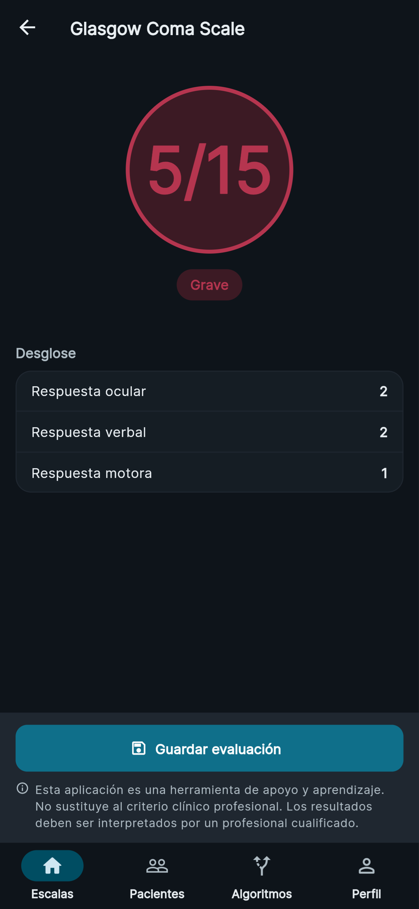

La pantalla de resultado muestra la puntuación total en un círculo diana con el color de severidad, el desglose por ítem y el aviso clínico. El botón «Guardar» es sticky en la parte inferior. La animación `AnimatedCheck` confirma el guardado.

### Gráfico de evolución de paciente (web)

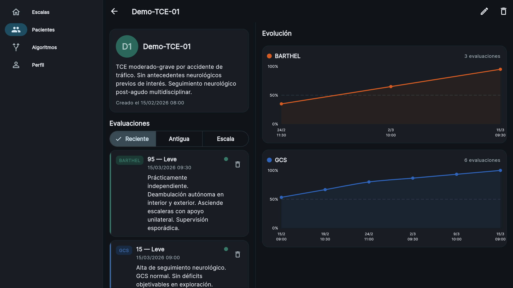

La pantalla de detalle de paciente muestra el historial de evaluaciones y el `LineChart` de evolución. El eje X es temporal y proporcional al tiempo real; el eje Y refleja la puntuación normalizada. Los tooltips muestran la puntuación exacta y la fecha al pulsar un punto.

### Algoritmo clínico (web)

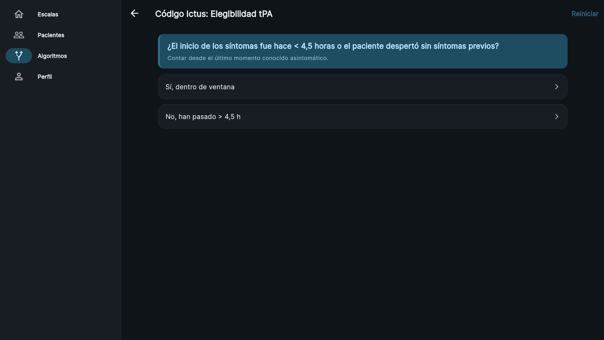

La pantalla de algoritmo presenta la pregunta actual con las opciones como tarjetas táctiles. La animación de barrido lateral separa visualmente cada paso del árbol de decisión. El resultado muestra el nivel de urgencia con el color clínico correspondiente y las recomendaciones.

### Tema claro — pantalla de escalas

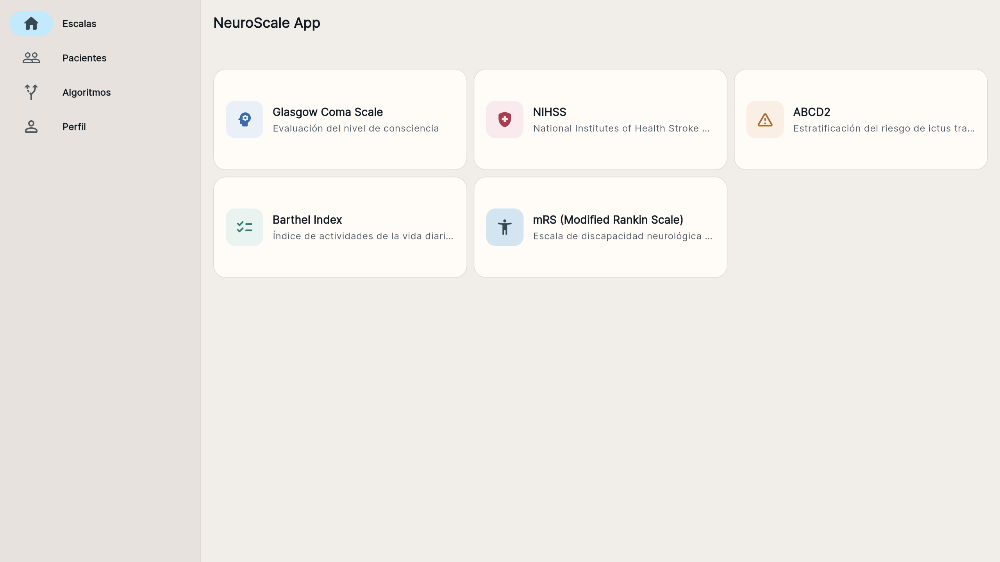

Vista de la aplicación con el tema claro activado. La paleta usa tonos teal y navy sobre fondo blanco roto, manteniendo el contraste mínimo WCAG AA en todos los textos sobre fondo.

### Gráfico en tema claro

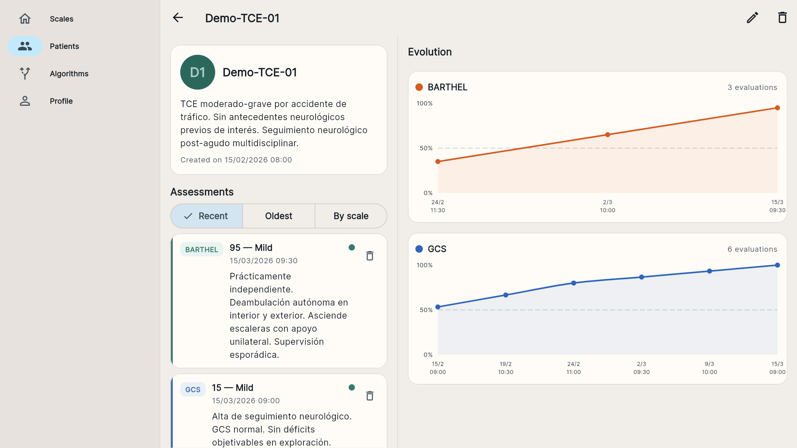

Detalle del gráfico de evolución temporal en tema claro, con la serie de puntuaciones representada sobre fondo blanco. La cuadrícula de guía usa trazos finos para no competir visualmente con la línea de datos.
