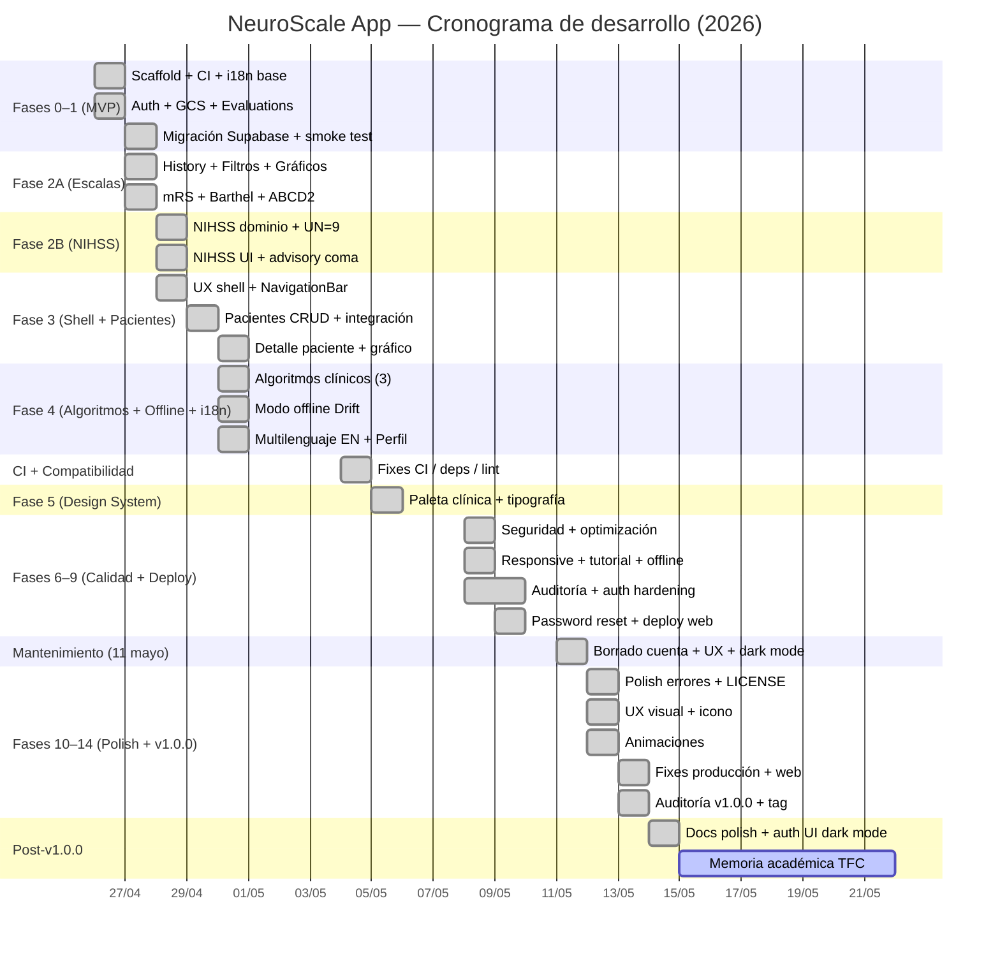

# Metodología, Planificación y Presupuesto

## Metodología

### Enfoque de desarrollo

El proyecto se ha desarrollado siguiendo un modelo iterativo por fases, con entregables funcionales al final de cada iteración. La unidad mínima de trabajo es la subfase, y cada una recorre el mismo ciclo:

```
Diseño → Aprobación → Implementación → Tests → flutter analyze → Commit de cierre
```

La regla que se mantuvo a lo largo de todo el proyecto fue no escribir código sin aprobar antes el diseño de la subfase. Esta restricción tiene un coste evidente —obliga a parar y pensar incluso cuando se intuye qué hay que hacer—, pero a cambio reduce muchísimo el retrabajo estructural. En un proyecto con contexto médico, donde un cambio tardío en la arquitectura de una calculadora invalidaría los tests que ya verifican su corrección clínica, esta disciplina compensa con creces el coste inicial.

Claude Code (Anthropic, modelo Sonnet) actuó como asistente de implementación a lo largo de todo el proyecto, generando código, tests y documentación bajo mi dirección. Las horas que figuran en las tablas siguientes corresponden a sesión activa por mi parte (revisión de las salidas, pruebas manuales en dispositivo, decisiones de diseño y redireccionamiento del agente), no al tiempo de ejecución autónoma de la herramienta.

### Gestión de requisitos y trazabilidad

Las fases 0 a 9 se gestionaron mediante **issues numerados en GitHub** (`#1` a `#23`), cada uno con criterios de aceptación y enlace al commit de cierre. Las fases 10 a 14 y los mantenimientos posteriores se cerraron directamente mediante commits convencionales (`feat:`, `fix:`, `chore:`), dado el ritmo intensivo de iteración y la trazabilidad garantizada por el Gantt y el ROADMAP.

Formato de commits utilizado: **Conventional Commits** (`tipo(scope): descripción`). Todos los commits de cierre de subfase llevan el prefijo `chore(phase):` con las métricas actualizadas en ROADMAP y README.

### Control de calidad

- **Linting estricto**: `analysis_options.yaml` activa `flutter_lints`, `riverpod_lint` y `custom_lint`. El análisis estático bloquea imports absolutos, cadenas hardcodeadas, patrones Riverpod incorrectos y trailing commas ausentes.
- **CI obligatorio**: cada push a `main` ejecuta en orden: `dart format`, `flutter analyze`, `flutter test --coverage` y `osv-scanner`. Un fallo bloquea el merge.
- **TDD en dominio clínico**: las calculadoras de escala se implementaron con los tests escritos simultáneamente, cubriendo todos los umbrales clínicos y los casos límite. Un cálculo incorrecto en el dominio es inaceptable en una herramienta de apoyo clínico.
- **Revisiones holísticas**: en puntos clave del proyecto (pre-v1.0.0) se realizaron revisiones con el modelo Opus de Claude para detectar errores factuales, inconsistencias de redacción y deuda técnica.

### Decisiones arquitectónicas clave

| Decisión | Alternativa descartada | Motivación |
|---|---|---|
| Feature-first + Clean Architecture | Layer-first (`data/`, `domain/`, `presentation/` en raíz) | Con seis features, la cohesión por dominio escala mejor; un cambio en una feature no toca las demás. |
| TDD obligatorio en calculadoras | Tests opcionales o post-implementación | Contexto médico: un cálculo erróneo en GCS o NIHSS tiene potencial impacto clínico. Las funciones puras permiten tests triviales y exhaustivos. |
| Supabase + RLS | Firebase, backend propio | Auth + PostgreSQL + RLS en un único servicio gestionado; plan gratuito suficiente para el MVP. La RLS aísla datos por usuario a nivel de base de datos, independientemente del frontend. |
| `Failure` directamente en repositorios | `Either<L,R>` con `fpdart` | Reduce el boilerplate y se integra de forma natural con `AsyncValue.guard()` de Riverpod. |
| i18n desde el MVP | Añadir tras completar el MVP | En Flutter, incorporar i18n a posteriori requiere modificar todos los widgets. Desde el inicio el coste es de un día; a posteriori, de semanas. |
| `env/*.json` gitignoreado | Variables en CI | Los secretos nunca entran en el historial de Git. `--dart-define-from-file` funciona en web y CI sin dependencias adicionales. |

---

## Planificación

### Estimación inicial vs. horas reales

Las estimaciones se realizaron antes de iniciar cada fase. El alcance inicial cubría las **fases 0 a 4** (estimadas en 40,0 h); las fases 5 a 14 surgieron durante la ejecución como respuesta a hallazgos de auditoría, despliegue real en producción y decisiones de calidad.

| Fase | Descripción | Estimado (h) | Real (h) | Desviación |
|---|---|---:|---:|---:|
| Diseño inicial | Arquitectura, setup | 1,0 | 2,0 | +1,0 |
| Fase 0 | Scaffold Flutter + CI + i18n | 2,0 | 1,5 | −0,5 |
| Fase 1 | Auth + GCS + Evaluations + Supabase | 8,0 | 7,0 | −1,0 |
| Fase 2A | History + Filtros + Gráficos + mRS + Barthel + ABCD2 | 12,5 | 12,5 | 0,0 |
| Fase 2B | NIHSS (UN=9, advisory coma, UI) | 6,0 | 5,0 | −1,0 |
| Fase 3 | UX shell + Pacientes (CRUD + evolución) | 10,5 | 11,0 | +0,5 |
| Fase 4 | Algoritmos + Offline + i18n EN + Perfil | 10,0 | 6,5 | −3,5 |
| **Subtotal fases 0–4** | | **50,0** | **45,5** | **−4,5** |
| Fase 5 | Design system (paleta clínica, tipografía, animaciones base) | — | 1,0 | — |
| Fase 6 | Seguridad + optimización backend + refactor i18n | — | 4,0 | — |
| Fase 7 | Offline banner + responsive + modo tutorial | — | 2,5 | — |
| Fase 8 | Auditoría post-Fase 7 + auth hardening | — | 3,0 | — |
| Fase 9 | Password reset + deploy web + APK firmado | — | 3,5 | — |
| Mantenimiento 2026-05-11 | Borrado, admin cuenta, tema oscuro, UX global | — | 9,5 | — |
| Fase 10 | Polish: errores localizados, ValidationException, LICENSE | — | 3,0 | — |
| Fase 11 | UX visual: avatar hash, layout web, auth card, icono | — | 4,5 | — |
| Fase 12 | Animaciones: transiciones, AnimatedCheck, algoritmos | — | 4,5 | — |
| Fase 13 | Fixes UX evaluaciones + producción web | — | 6,0 | — |
| Fase 14 | Auditoría v1.0.0 (RLS, tokens spacing, a11y, tests) | — | 2,5 | — |
| Post-v1.0.0 | Licencia, auth UI dark mode, docs polish | — | 2,0 | — |
| **Subtotal fases 5–14 + mantenimientos** | | — | **49,5** | — |
| **TOTAL ACUMULADO** | | — | **~85,0** | — |

**Análisis de desviaciones (fases 0–4).** El balance global en las fases que sí contaban con estimación previa fue de −4,5 h, un 9 % por debajo de lo previsto. Las desviaciones a favor se concentraron sobre todo en la Fase 4: las `sealed classes` de Dart 3 simplificaron mucho los algoritmos clínicos (ahorro de unas 2,5 h) y la pantalla de perfil resultó casi inmediata una vez resuelta la lógica de idioma en la subfase anterior (ahorro de 1,5 h). La única desviación al alza apreciable fue el diseño inicial, que necesitó una hora más de la prevista porque la infraestructura compartida (errores, extensiones, providers comunes) acabó teniendo más capas de las que había planteado al principio. En conjunto, la estimación inicial fue ligeramente pesimista, lo que en mi experiencia es preferible a quedarse corto.

### Diagrama de Gantt

> **Nota**: renderizar el bloque Mermaid en [mermaid.live](https://mermaid.live) y exportar como PNG para el documento final.



**Resumen temporal:** el desarrollo software activo abarcó **19 días** (2026-04-26 a 2026-05-14), con mayor densidad de commits en los cuatro primeros días (MVP) y en el sprint de cierre (fases 10–14). La elaboración de la memoria académica se inicia el 2026-05-15.

---

## Presupuesto

El presupuesto refleja el coste estimado de desarrollar el proyecto en condiciones de mercado. Como proyecto académico, los costes reales incurridos son menores (licencias gratuitas, herramientas open-source, servicios en plan gratuito).

### Costes de desarrollo

| Concepto | Horas | Tarifa (junior) | Tarifa (sénior ref.) |
|---|---:|---:|---:|
| Diseño arquitectónico e investigación | 8,0 h | €25/h | €60/h |
| Implementación (backend, dominio, UI) | 52,0 h | €25/h | €60/h |
| Testing y calidad (TDD, auditorías) | 10,0 h | €25/h | €60/h |
| DevOps y despliegue (CI/CD, web, APK) | 5,0 h | €25/h | €60/h |
| Documentación técnica | 10,0 h | €25/h | €60/h |
| **Total horas** | **85,0 h** | | |
| **Subtotal desarrollo** | | **2.125 €** | **5.100 €** |

> La tarifa de referencia junior (€25/h) corresponde al rango habitual para un desarrollador Flutter con menos de dos años de experiencia en el mercado español (2026). La tarifa sénior (€60/h) se incluye como cota superior para contextualizar el valor del proyecto.

### Costes de servicios y herramientas

| Servicio / Herramienta | Plan utilizado | Coste mensual | Coste del proyecto (1 mes) |
|---|---|---:|---:|
| Supabase (Auth + PostgreSQL + Edge Functions) | Free | 0 € | 0 € |
| GitHub (repositorio, Actions, Pages) | Free | 0 € | 0 € |
| Android (APK firmado, sin Play Store) | — | 0 € | 0 € |
| Flutter SDK | Open-source | 0 € | 0 € |
| Visual Studio Code | Open-source | 0 € | 0 € |
| Claude Code (asistente IA) | Suscripción mensual | ~20 € | ~20 € |
| **Subtotal servicios** | | | **~20 €** |

### Coste total estimado

| Concepto | Importe |
|---|---:|
| Desarrollo (tarifa junior, 85 h × 25 €/h) | 2.125 € |
| Servicios y herramientas | 20 € |
| **Total (tarifa junior)** | **2.145 €** |
| **Total (tarifa sénior, referencia)** | **5.120 €** |

**Coste real incurrido**: ~20 € (suscripción mensual a Claude Code). El resto de servicios y herramientas son gratuitos para el uso académico descrito.

### Comparativa con soluciones alternativas

A efectos de contextualizar el valor del proyecto, se compara con el coste de contratar el desarrollo a una empresa externa:

| Escenario | Estimación |
|---|---|
| Empresa de desarrollo a medida (precio de mercado España, app móvil multiplataforma con backend) | 15.000 € – 40.000 € |
| NeuroScale App (coste real desarrollador único, herramientas gratuitas) | ~20 € |
| NeuroScale App (valoración a tarifa de mercado junior) | ~2.145 € |

La diferencia refleja la reducción de coste que supone el uso de herramientas de IA generativa (Claude Code) para acelerar la implementación, combinada con el uso de servicios BaaS gratuitos (Supabase, GitHub Pages) y el modelo de desarrollo en solitario del TFC.
