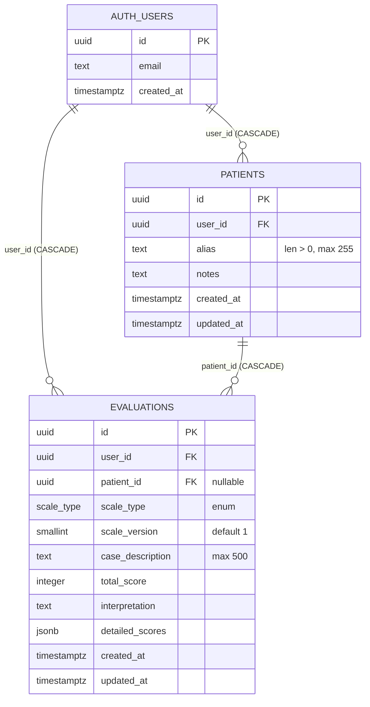

# Supabase — esquema, migraciones y Edge Functions

Documentación del backend de NeuroScale App: estructura de tablas, política de migraciones, Row Level Security y funciones de borde.

---

## Tabla de contenidos

- [1. Modelo de datos](#1-modelo-de-datos)
- [2. Migraciones SQL](#2-migraciones-sql)
- [3. Convenciones](#3-convenciones)
- [4. Aplicación de migraciones](#4-aplicación-de-migraciones)
- [5. Verificar migraciones aplicadas](#5-verificar-migraciones-aplicadas)
- [6. Buenas prácticas antes de producción](#6-buenas-prácticas-antes-de-producción)
- [7. Edge Functions](#7-edge-functions)

---

## 1. Modelo de datos

El esquema relaciona dos tablas propias (`evaluations`, `patients`) con la tabla `auth.users` gestionada por Supabase Auth. Ambas heredan el `user_id` y aplican RLS.



**Tipos personalizados**:

- `scale_type` — enum con los valores `'gcs'`, `'nihss'`, `'rankin'`, `'barthel'`, `'abcd2'`. Para añadir un nuevo valor se utiliza `alter type scale_type add value 'nueva_escala';` en una nueva migración.

**Triggers**:

- `handle_updated_at()` — función `plpgsql` con `search_path = public` (fijado en migración `0006`) que actualiza el campo `updated_at` en cada `UPDATE`. Activa en `evaluations` (trigger `set_updated_at`) y `patients` (trigger `set_updated_at_patients`).

**Row Level Security**: las dos tablas tienen RLS habilitado con cuatro políticas cada una (SELECT, INSERT, UPDATE, DELETE), todas con la forma `(select auth.uid()) = user_id` desde la migración `0009`. El detalle completo está documentado en [`../docs/SECURITY.md`](../docs/SECURITY.md) §2.

---

## 2. Migraciones SQL

Las migraciones viven en `supabase/migrations/` y se aplican en orden numérico estricto.

| Archivo | Cambio | Fase |
|---|---|---|
| `0001_init.sql` | Tabla `evaluations`, enum `scale_type`, RLS de cuatro políticas, trigger `updated_at`, función `handle_updated_at`. | 1 |
| `0002_add_abcd2.sql` | Añade `'abcd2'` al enum `scale_type` (idempotente). | 2A |
| `0003_add_patients.sql` | Tabla `patients` con RLS, FK opcional `evaluations.patient_id` (inicialmente `on delete set null`). | 3.2 |
| `0004_constrain_case_description.sql` | `CHECK (length(case_description) <= 500)` como defensa server-side complementaria al detector de PII en cliente. | 6.1 |
| `0005_add_scale_type_index.sql` | Índice compuesto `(user_id, scale_type, created_at desc)` para filtros de historial. | 6.2 |
| `0006_fix_function_search_path.sql` | Fija `search_path = public` en `handle_updated_at()`. Resuelve advertencia de Security Advisor sobre `function-search-path-mutable`. | 8.2 |
| `0007_cascade_delete_patient_evaluations.sql` | Cambia `evaluations.patient_id` de `on delete set null` a `on delete cascade`. Al borrar un paciente se borran sus evaluaciones. | Mantenimiento |
| `0008_fix_legacy_interpretation_keys.sql` | Normaliza claves de interpretación antiguas en español a claves ARB canónicas. Idempotente. | Mantenimiento |
| `0009_optimize_rls_auth_calls.sql` | Reescribe las 8 políticas RLS usando `(select auth.uid())` para evaluación una vez por sentencia (no por fila). | 14.A |
| `0010_drop_unused_indexes.sql` | Elimina `evaluations_patient_id_idx` y `evaluations_user_scale_created_idx`, detectados como no usados por Performance Advisor. | 14.A |
| `0011_patients_alias_length.sql` | `CHECK (length(alias) <= 255)` en `patients.alias` como límite razonable para cualquier alias clínico. | 14.A |

---

## 3. Convenciones

- **Nomenclatura**: `NNNN_descripcion_corta.sql` con padding a cuatro dígitos. La descripción usa snake_case y describe el cambio principal.
- **Idempotencia**: las migraciones deben poder re-ejecutarse sin error. Usa `if not exists`, `add value if not exists`, `drop policy if exists`, etc.
- **RLS obligatoria**: toda tabla con columna `user_id` debe tener RLS habilitada y políticas `auth.uid() = user_id` para las cuatro operaciones (SELECT, INSERT, UPDATE, DELETE).
- **Sin PII**: ningún campo libre puede contener datos identificativos personales. La validación en cliente (regex en `pii_detector.dart`) se complementa con `CHECK` de longitud en servidor.
- **Comentarios obligatorios**: cabecera de cada migración con número, propósito breve y fase asociada.

---

## 4. Aplicación de migraciones

El proyecto no usa `supabase db push` automatizado. Cada migración se aplica manualmente:

1. Abrir el proyecto correspondiente en **Supabase Studio**.
2. Navegar a **SQL Editor → New Query**.
3. Pegar el contenido íntegro del archivo a aplicar.
4. Ejecutar y revisar el resultado.
5. Verificar con la pestaña **Table Editor** que los cambios se reflejan en el esquema.

---

## 5. Verificar migraciones aplicadas

Supabase mantiene un registro de migraciones aplicadas en la tabla `supabase_migrations.schema_migrations` cuando se utiliza la CLI. Para entornos donde se aplican manualmente, conviene mantener una pista en la tabla `pg_class` o anotar el último archivo aplicado.

### Comprobar el esquema actual

```sql
-- Listar tablas creadas por la aplicación
select table_name
from information_schema.tables
where table_schema = 'public'
  and table_type = 'BASE TABLE'
order by table_name;

-- Verificar que las políticas RLS están en su sitio
select tablename, policyname, cmd
from pg_policies
where schemaname = 'public'
order by tablename, cmd;

-- Verificar el enum scale_type
select enumlabel
from pg_enum
where enumtypid = 'scale_type'::regtype
order by enumsortorder;
```

Resultado esperado tras aplicar todas las migraciones:

- 2 tablas en `public` (`evaluations`, `patients`).
- 8 políticas RLS (4 por tabla).
- 5 valores en el enum `scale_type` (`gcs`, `nihss`, `rankin`, `barthel`, `abcd2`).

---

## 6. Buenas prácticas antes de producción

Antes de aplicar una migración al proyecto de producción:

1. **Backup explícito**. En Supabase Pro, la opción **Database → Backups → Create Backup** está disponible. En el plan gratuito, exportar mediante `pg_dump` desde un cliente con la contraseña de servicio.
2. **Probar en preview branch**. Si el plan permite ramas de base de datos, aplicar primero allí y verificar.
3. **Ejecutar en ventana de poco tráfico**. Especialmente para migraciones con `ALTER TABLE` que adquieren locks.
4. **Revisar Performance Advisor y Security Advisor** después del despliegue (Supabase Studio → Advisors).
5. **Documentar el orden en este README** antes del push de la migración a `main`.
6. **No editar migraciones ya aplicadas**. Si hace falta corregir, crear una nueva migración inversa o complementaria.

---

## 7. Edge Functions

Las funciones de borde viven en `supabase/functions/<nombre>/index.ts`. Se implementan en TypeScript sobre Deno y se despliegan con `supabase functions deploy <nombre>` o desde el Dashboard.

### `delete-account`

Función para el flujo de borrado de cuenta. Requiere privilegios de administrador (`service_role`), por lo que no puede ejecutarse desde el cliente.

| Aspecto | Valor |
|---|---|
| Archivo | `supabase/functions/delete-account/index.ts` |
| Versión | v1 |
| `verify_jwt` | `true` (validación de JWT antes de ejecutar el código) |
| Variables de entorno | `SUPABASE_URL`, `SUPABASE_ANON_KEY`, `SUPABASE_SERVICE_ROLE_KEY` |

Flujo de ejecución:

1. El cliente invoca la función con el JWT del usuario en `Authorization: Bearer <token>`.
2. La función crea un cliente con `anon_key` + el JWT para validar la identidad del invocante mediante `auth.getUser()`.
3. Tras la validación, crea un segundo cliente con `service_role_key` (no expuesta al cliente).
4. Invoca `auth.admin.deleteUser(user.id)`.
5. Las migraciones `0001` y `0003` aseguran que el borrado en `auth.users` propaga `ON DELETE CASCADE` a `evaluations` y `patients`.

Documentación del modelo de seguridad asociado en [`../docs/SECURITY.md`](../docs/SECURITY.md) §7.

---

## Documentos relacionados

- [`../docs/SECURITY.md`](../docs/SECURITY.md) — modelo de seguridad, RLS y PII.
- [`../docs/RELEASE_GUIDE.md`](../docs/RELEASE_GUIDE.md) — secretos y despliegue.
- [`../docs/ROADMAP.md`](../docs/ROADMAP.md) — fases donde se introdujo cada migración.
